# Codex Rescue Orchestrator

[](#evidence-ledger)
[](#verify-the-source)
[](https://github.com/Morlock52/codex-rescue-usb/actions/workflows/orchestrator-ci.yml)
[](#install-the-orchestrator)
[](LICENSE)

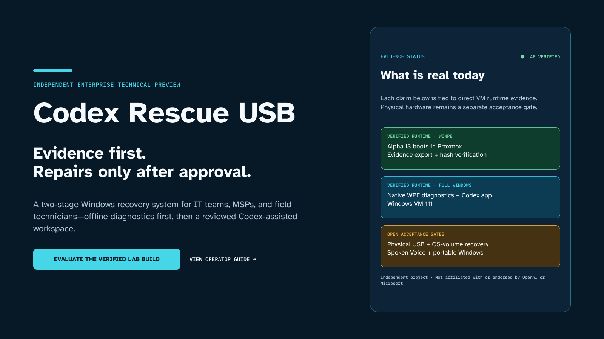

> **Independent Enterprise Technical Preview.** Codex Rescue Orchestrator is an operator-controlled Windows recovery-media project for enterprise IT teams, MSPs, and field engineers. It is not affiliated with or endorsed by OpenAI, Microsoft, or Proxmox.

One application guides the operator from workstation audit to signed updates, four WinPE builds, isolated Proxmox tests, guarded USB creation, rollback-backed UEFI repair, advanced BitLocker salvage, and evidence receipts. “One click” means one coherent application and one primary workflow. It does not bypass UAC, licenses, network consent, target confirmation, or destructive-action gates.

Codex remains the assisted troubleshooting experience in **full Windows**. WinPE performs the narrow offline recovery work. Recovery keys, raw customer evidence, and privileged scripts never become model input automatically.

## What this milestone delivers

The repository now contains the source implementation for:

- a self-contained .NET 8 WPF application, `CodexRescue.Orchestrator`;
- a narrow per-action elevated executable, `CodexRescue.Broker`;
- versioned plan, receipt, checkpoint, update, Proxmox, and telemetry contracts;
- a signed-release and hash verifier for online and offline updates;
- a four-artifact x64/Arm64, 2023-CA/2011-CA WinPE build matrix;
- a certificate-pinned, session-scoped Proxmox test connector;
- guarded USB, UEFI backup/repair/rollback, and `.bek` salvage scripts;
- opt-in, allowlisted telemetry policy with zero transmission by default;
- signed MSIX/App Installer packaging and Azure Artifact Signing release workflows;
- a complete Figma workflow system translated into shared WPF resources; and
- guided WPF Plan/Apply controls for toolchain, media, Proxmox, USB, UEFI, and salvage workflows.

This milestone does **not** yet include a publicly signed MSIX release, live Proxmox connector receipt, new four-ISO build receipt, positive virtual USB write, disposable-VM UEFI repair/rollback receipt, `.bek` salvage receipt, Arm64 hardware result, or physical USB result. Those evidence gates are deliberately kept open below.

## Why technical teams evaluate it

- **One guided control plane.** The app separates Audit, Plan, Apply, Verify, Receipt, and Resume instead of presenting a collection of unbounded scripts.
- **Small privilege boundary.** The standard-user UI cannot send a shell command or arbitrary script path to the broker. Each elevated operation maps to one packaged, signed, hash-cataloged asset.
- **Evidence before action.** A changed disk identity, expired plan, changed manifest, ambiguous Windows/EFI pair, unavailable rollback, or untrusted signer invalidates approval.
- **Offline and private by default.** Startup auditing performs no network requests. Updates need a time-limited maintenance window. Telemetry needs both administrator policy and operator consent.
- **Codex without putting it in WinPE.** The supported Codex desktop app runs in maintained full Windows; WinPE remains a fixed-purpose recovery stage. OpenAI documents that the [Codex app is available on Windows](https://openai.com/index/introducing-the-codex-app/).
- **Literal evidence labels.** Source test, Figma design, VM runtime, emulation, virtual target, physical hardware, and production acceptance are not interchangeable.

## Product workflow

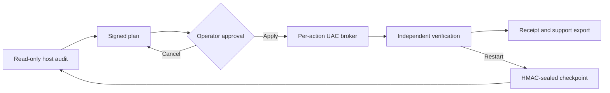

The standard-user app owns navigation and state. The broker accepts only typed, allowlisted operations. Packaged PowerShell assets must match the signed catalog and expected signer. A Git checkout is useful for development and documentation, but checkout scripts never become privileged runtime code automatically.

## Interface tour

All seven images in this section are **Figma designs—not runtime evidence**. They define the target layout, keyboard focus, status language, offline states, UAC cancellation, reboot/resume, and Guided/Expert variants. Runtime comparison remains an acceptance gate until the WPF package is built and captured on Windows.

### Setup and Updates

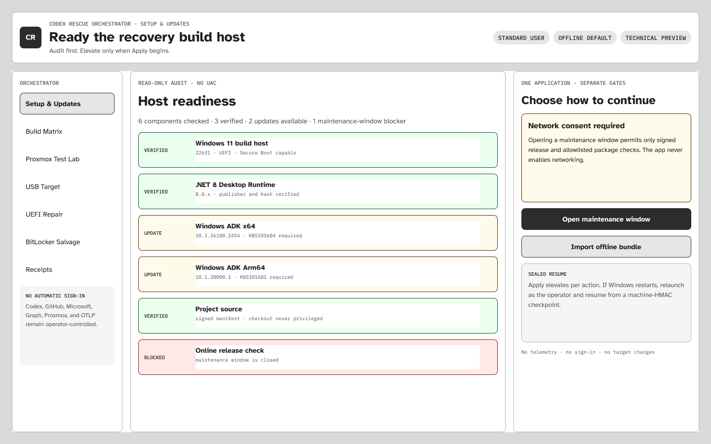

*Figma design · not runtime evidence.* Audit locally, review exact components, open a time-bounded maintenance window, then apply one signed plan.

### Build Matrix

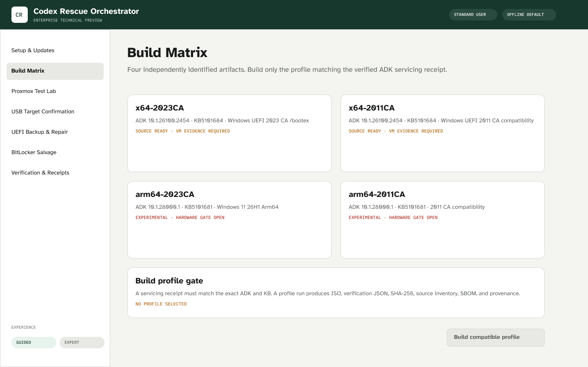

*Figma design · not runtime evidence.* Every artifact carries architecture, trust path, ADK, servicing update, source inventory, ISO hash, SBOM, provenance, and an independent evidence tier.

### Proxmox Test Lab

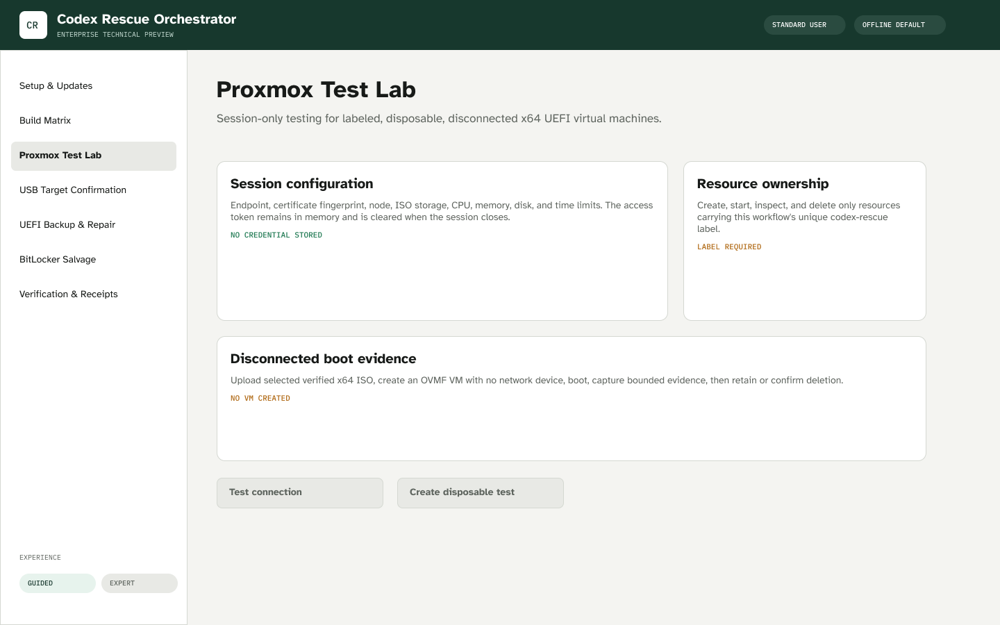

*Figma design · not runtime evidence.* The connector uses a pinned HTTPS certificate, bounded resources, a session token, a unique label, and a disconnected disposable x64 UEFI VM.

### USB Target Confirmation

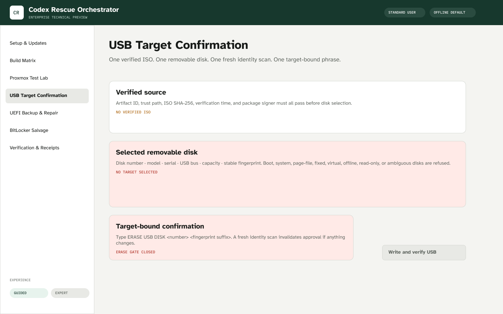

*Figma design · not runtime evidence.* The destructive gate shows disk model, serial, bus, size, number, ISO trust path, ISO hash, and a target-bound phrase.

### UEFI Backup and Repair

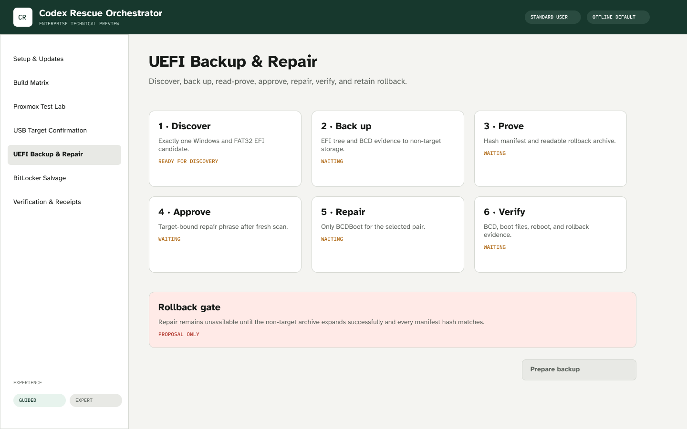

*Figma design · not runtime evidence.* A readable backup and manifest are mandatory before the narrowly scoped BCDBoot repair can be approved.

### BitLocker Salvage

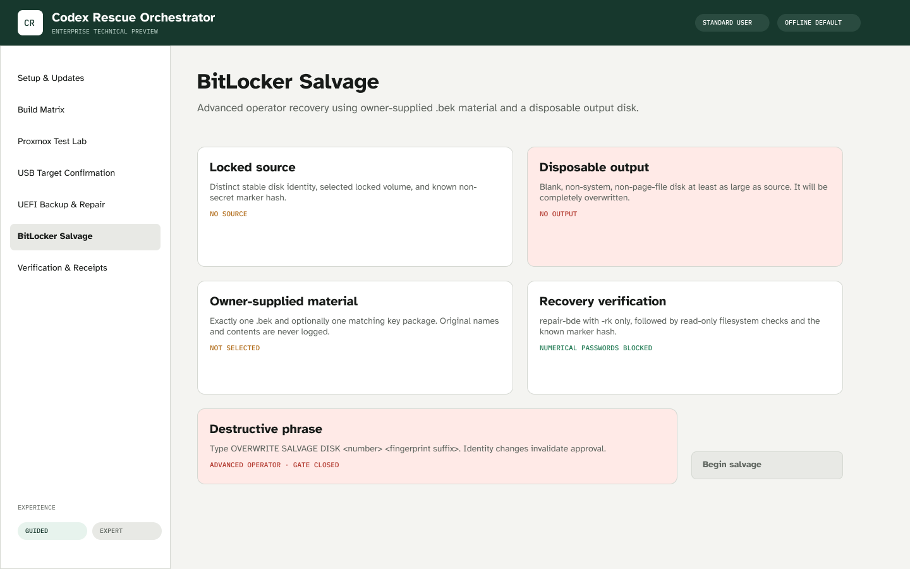

*Figma design · not runtime evidence.* This Expert workflow supports only owner-supplied `.bek` material and an optional key package. The output volume is completely overwritten.

### Verification, Receipts, and Support Export

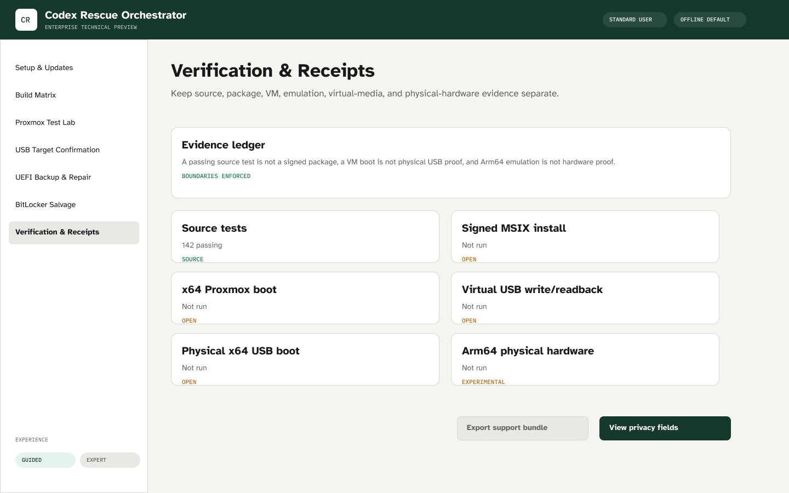

*Figma design · not runtime evidence.* Receipts show before/after evidence, changes, normalized results, restart state, privacy declarations, and the evidence tier.

The existing project also has real earlier-stage VM evidence:

| Screenshot | Evidence label | What it proves |
| --- | --- | --- |
|  | Proxmox x64 UEFI VM runtime | The exact alpha.13 baseline ISO reached its bounded WinPE prompt |
| 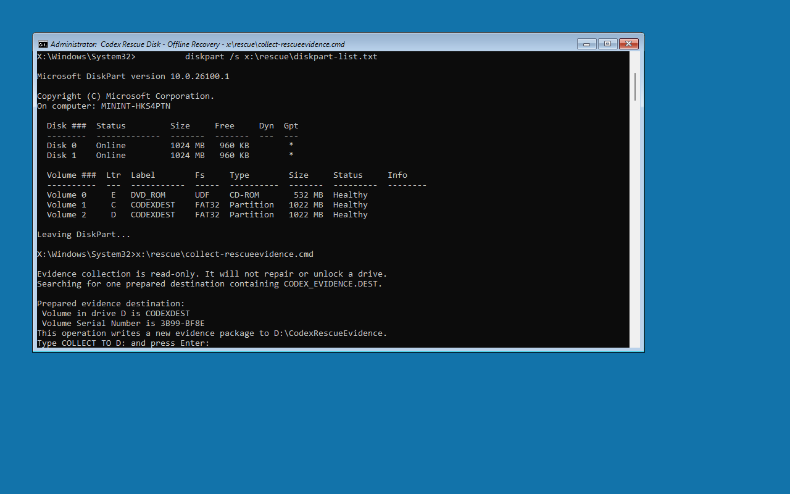 | Disposable WinPE VM runtime | The baseline evidence flow required a prepared destination and exact token |
| 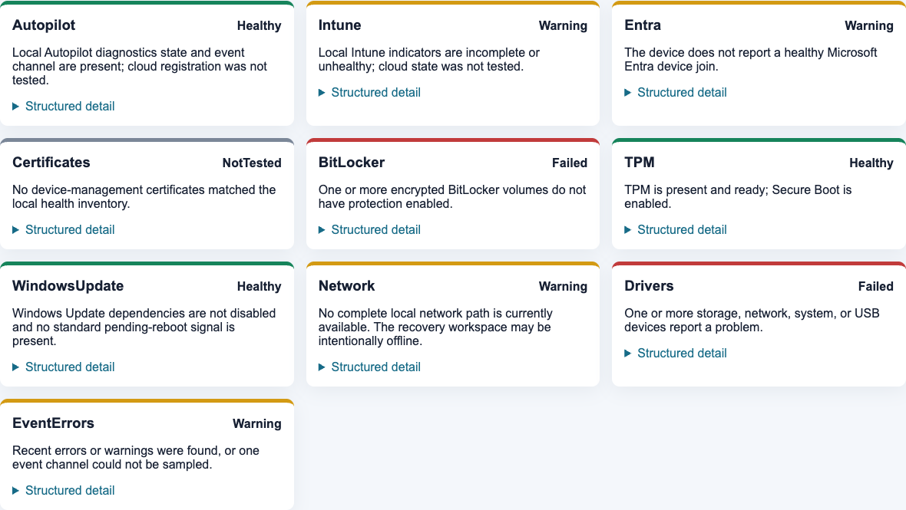 | Windows VM 111 runtime | The existing read-only Windows assessment produced validated diagnostic cards |
|  | Privacy-cropped Windows VM 111 runtime | The Codex desktop project opened in full Windows; spoken audio was not proved |

These older runtime images do not prove the new Orchestrator package or destructive workflows.

## Install the Orchestrator

### Recommended: signed App Installer release

The release pipeline is implemented, but the first public signed release is still gated on Azure Artifact Signing identity validation, protected GitHub environment configuration, a clean Windows build/test run, and package acceptance. Until a release on the [GitHub Releases page](https://github.com/Morlock52/codex-rescue-usb/releases) contains all of the following, do not treat an installer as production-signed:

- `CodexRescue.appinstaller`;
- `CodexRescue.Orchestrator_<version>.msixbundle`;
- `release-manifest.json` and detached `release-manifest.json.p7`;
- `SHA256SUMS.txt`;
- SPDX SBOM;
- rollback metadata; and
- GitHub build-provenance attestation.

When the first signed release passes those gates:

1. Open the release in Windows 11.
2. Download `CodexRescue.appinstaller` directly. The `ms-appinstaller:` browser protocol is disabled by default on current Windows, so the supported path is download and double-click. See Microsoft’s [App Installer file overview](https://learn.microsoft.com/en-us/windows/msix/app-installer/app-installer-file-overview).
3. Double-click the downloaded file.
4. Verify the displayed publisher matches the documented Codex Rescue publisher.
5. Select **Install**. Windows keeps the UAC and package-trust prompts visible.
6. Launch **Codex Rescue Orchestrator** from Start.

Unsigned CI packages are named `CodexRescue-UNSIGNED-DEVELOPER`. They are developer artifacts, not a supported install and not a substitute for the signed release.

### Build the application from source

Use a Windows 11 x64 development VM with the .NET 8 SDK. Building the WPF source does not make it signed.

```powershell
git clone https://github.com/Morlock52/codex-rescue-usb.git
Set-Location .\codex-rescue-usb
git switch main

dotnet restore .\orchestrator\CodexRescue.Orchestrator.sln
dotnet build .\orchestrator\CodexRescue.Orchestrator.sln -c Release --no-restore
dotnet test .\orchestrator\CodexRescue.Orchestrator.sln -c Release --no-build
dotnet run --project .\orchestrator\src\CodexRescue.Orchestrator
```

The source app runs as a standard user. Do not copy a developer build into a recovery workflow and relax the signature checks to make it run.

### First run

1. Leave the maintenance window closed.
2. Select **Run audit**. The audit reads local Windows, ADK, signing, Codex, Proxmox, and privacy readiness only.
3. Review every **Installed**, **Outdated**, **Missing**, **Blocked**, or **Unverified** result.
4. Choose Guided for explanations or Expert for contract details; both modes use the same safety gates.
5. Open a maintenance window only if downloads are required. The window needs explicit network consent and expires after 30 minutes.
6. Review the plan. UAC occurs only when Apply begins.
7. If a reboot is required, relaunch the app. Only non-secret workflow state is restored from the machine-sealed checkpoint.

The app never signs in to Codex, GitHub, Microsoft Graph, Proxmox, or Microsoft automatically.

## Update, offline update, rollback, and uninstall

### Signed online update

1. Open **Setup & Updates**.
2. Select **Open maintenance window** and consent to the release check.
3. Select **Check signed release**.
4. The updater checks only `Morlock52/codex-rescue-usb` during that window.
5. It downloads the manifest, detached signature, and manifest-listed artifacts.
6. It validates the trusted code-signing chain, stable publisher identity, schema, artifact paths, sizes, and SHA-256 values.
7. Review the version and select **Open App Installer**. Installation remains visible and operator-controlled.

No GitHub login is used for the public release check. A failed signature, changed hash, expired maintenance window, missing artifact, unsupported schema, or downgrade stops the update.

### Hash-verified offline update

1. On a connected administrative workstation, obtain the complete signed offline ZIP from the release.
2. Transfer it using your organization’s approved media process.
3. In **Setup & Updates**, select **Import offline bundle**.
4. Choose the ZIP. The importer rejects absolute paths and ZIP path traversal.
5. The bundle is extracted to a private staging directory and fully verified before promotion.
6. Review the verified publisher and version, then open the local `.appinstaller` file.

Importing a bundle never executes a script or package automatically.

### N-1 rollback

The verified release cache retains only the current version and N-1. A lower or duplicate version is refused as an update. Rollback is a separate operator action:

1. Open **Setup & Updates**.
2. Select **Open verified N-1 rollback**.
3. The Orchestrator re-verifies the cached N-1 manifest, trusted timestamp, publisher, package size, and SHA-256.
4. Type the displayed `ROLL BACK TO <version>` phrase.
5. Review the lower version and publisher in Windows App Installer, then approve only when the support plan requires it.

Windows blocks lower versions by default. The Orchestrator therefore generates a new local, single-purpose App Installer descriptor containing `ForceUpdateFromAnyVersion=true` only after N-1 re-verification and explicit approval. It does not add that setting to the normal update feed or run a hidden package command. See Microsoft’s [MSIX downgrade guidance](https://learn.microsoft.com/en-us/windows/msix/app-package-updates).

### Uninstall

1. Open **Settings > Apps > Installed apps**.
2. Find **Codex Rescue Orchestrator**.
3. Select **Uninstall** and confirm.
4. Remove the local verified update cache only if your evidence-retention policy permits it.

Uninstalling the app does not delete exported receipts, support bundles, previously built ISOs, or USB media.

## Use every Orchestrator feature

### 1. Setup and Updates

**Beginner example:** run the audit, read the explanation under each missing component, review the install plan, accept package agreements yourself, and apply. If UAC is cancelled, the workflow returns to Plan Ready without pretending anything changed.

**Expert example:** export the plan, confirm exact package IDs and versions, validate the manifest digest and prerequisites, then compare the resulting `ActionReceiptV1` before/after evidence with the host audit.

Toolchain Apply supports exact allowlisted WinGet and PowerShell Gallery packages. WinGet’s package and source agreement switches suppress prompts, so the Orchestrator requires a separate explicit agreement decision before using them. Microsoft documents those switches in the [WinGet install contract](https://learn.microsoft.com/en-us/windows/package-manager/winget/install).

### 2. Build Matrix

The matrix produces four independently named artifacts:

| Artifact | Architecture | Secure Boot trust path | Required ADK and servicing | Evidence boundary |
| --- | --- | --- | --- | --- |
| `x64-2023CA` | x64 | Windows UEFI 2023 CA, `/bootex` | ADK `10.1.26100.2454` + `KB5101684` | x64 VM and hardware gates |
| `x64-2011CA` | x64 | Windows UEFI 2011 CA compatibility | ADK `10.1.26100.2454` + `KB5101684` | x64 VM and hardware gates |
| `arm64-2023CA` | Arm64 | Windows UEFI 2023 CA, `/bootex` | ADK `10.1.28000.1` + `KB5101681` | Experimental until Arm64 hardware |
| `arm64-2011CA` | Arm64 | Windows UEFI 2011 CA compatibility | ADK `10.1.28000.1` + `KB5101681` | Experimental until Arm64 hardware |

Microsoft’s July 28, 2026 [ADK servicing guidance](https://learn.microsoft.com/en-us/windows-hardware/get-started/adk-servicing) identifies those current patches, security fixes, and updated `/bootex` support. Microsoft’s [WinPE media guidance](https://learn.microsoft.com/en-us/windows-hardware/manufacture/desktop/winpe-create-usb-bootable-drive?view=windows-11) uses `/bootex` for 2023-CA media and omits it for 2011-CA compatibility media.

Install the matching ADK and WinPE add-on, apply the servicing package, and preserve its receipt. Then run:

```powershell
$sourceRevision = (git rev-parse HEAD).Trim()
.\scripts\Build-CodexRescueMediaMatrix.ps1 `
  -ServicingReceiptPath 'C:\CodexRescue\receipts\adk-servicing.json' `
  -OutputDirectory 'C:\CodexRescue\dist\media' `
  -SourceRevision $sourceRevision
```

The signed Orchestrator obtains `SourceRevision` from its signed asset catalog automatically; the explicit argument above is required for a Git checkout. The builder runs only profiles matching that receipt. Run once on the x64 ADK and once on the Arm64 ADK. Each output receives its ISO, verification JSON, SHA-256 file, injected-source inventory, required-package result, SPDX SBOM, and provenance JSON. The provenance JSON is an unsigned build record until a protected release adds an external attestation. A successful build is not boot evidence.

### 3. Proxmox Test Lab

**Beginner example:** enter the HTTPS endpoint, paste the server certificate SHA-256 fingerprint after verifying it out of band, select a storage and node, supply a session API token, choose an x64 ISO, and create the disconnected test VM.

**Expert example:** inspect CPU, fixed memory, disk, maximum run time, ISO SHA-256, unique label, OVMF configuration, and no-NIC configuration before creation. Collect bounded boot status, then type the VM-specific delete phrase. The connector re-reads the VM tags before deletion.

The connector:

- accepts only HTTPS with a pinned SHA-256 certificate fingerprint;
- keeps API tokens in process memory for the session by default;
- permits Windows Credential Manager only under administrator policy;
- uploads an ISO under its unique `codex-rescue-<session>` name;
- creates only a bounded x64 `q35`/OVMF VM without `net0`;
- manages only VM IDs tracked by that session and carrying its label; and
- deletes only after `DELETE VM <id> <label>` is confirmed.

The endpoint and token are never embedded. A Proxmox VM result is not physical hardware proof. Arm64 emulation is Experimental evidence only.

### 4. Guarded USB creation

Plan mode is read-only:

```powershell
.\scripts\Write-CodexRescueUsb.ps1 `
  -Mode Plan `
  -IsoPath 'C:\CodexRescue\dist\Codex-Rescue-x64-2023CA.iso' `
  -VerificationPath 'C:\CodexRescue\dist\Codex-Rescue-x64-2023CA.iso.verification.json' `
  -DiskNumber 6
```

Record the displayed model, serial, bus, capacity, disk number, ISO hash, trust path, target fingerprint, and exact phrase. Apply only to disposable removable media:

```powershell
.\scripts\Write-CodexRescueUsb.ps1 `
  -Mode Apply `
  -IsoPath 'C:\CodexRescue\dist\Codex-Rescue-x64-2023CA.iso' `
  -VerificationPath 'C:\CodexRescue\dist\Codex-Rescue-x64-2023CA.iso.verification.json' `
  -DiskNumber 6 `
  -ConfirmationPhrase 'ERASE USB DISK 6 1A2B3C4D' `
  -OutputReceiptPath 'C:\CodexRescue\receipts\usb-6.json'
```

The writer re-scans immediately before `Clear-Disk`; rejects boot, system, page-file, fixed, virtual, ambiguous, offline, read-only, identity-changing, and non-USB disks; creates GPT/FAT32 UEFI media with built-in Windows tools; rejects payloads exceeding FAT32 limits; and reads back every copied file hash. The receipt must be stored on a different disk.

### 5. UEFI backup, repair, and rollback

Prepare on a disposable VM with separate evidence storage:

```powershell
.\scripts\Invoke-CodexRescueUefiRepair.ps1 `
  -Mode Prepare `
  -BackupDirectory 'R:\CodexRescue\uefi-backup' `
  -PlanPath 'R:\CodexRescue\uefi-plan.json'
```

Prepare requires exactly one Windows installation and one FAT32 EFI partition on the same healthy disk. It copies the EFI tree and BCD evidence to non-target storage, hashes every file, creates a rollback archive, expands it again, and proves the backup is readable.

Apply needs the exact phrase emitted by Prepare:

```powershell
.\scripts\Invoke-CodexRescueUefiRepair.ps1 `
  -Mode Apply `
  -PlanPath 'R:\CodexRescue\uefi-plan.json' `
  -ConfirmationPhrase '<phrase from the current plan>' `
  -OutputReceiptPath 'R:\CodexRescue\uefi-apply-receipt.json'
```

The only repair executable is BCDBoot for the selected Windows/EFI pair. Microsoft describes [BCDBoot](https://learn.microsoft.com/en-us/windows-server/administration/windows-commands/bcdboot) as the tool for setting up or repairing the system-partition boot environment. The workflow does not import an entire BCD store or run unrelated repair commands.

Rollback is separate and requires its own target-bound phrase:

```powershell
.\scripts\Invoke-CodexRescueUefiRepair.ps1 `
  -Mode Rollback `
  -PlanPath 'R:\CodexRescue\uefi-plan.json' `
  -ConfirmationPhrase '<rollback phrase from the plan>' `
  -OutputReceiptPath 'R:\CodexRescue\uefi-rollback-receipt.json'
```

Disposable-VM damage, repair, reboot, and rollback evidence remain open gates for this new executor.

### 6. Advanced BitLocker salvage

> **Danger: `repair-bde` completely overwrites the output volume.** Microsoft states this explicitly in the [`repair-bde` reference](https://learn.microsoft.com/en-us/windows-server/administration/windows-commands/repair-bde).

Create a plan only after attaching two disposable non-system disks and placing exactly one owner-supplied `.bek` plus, if required, one matching `.kpg` in a protected directory:

```powershell
.\scripts\Invoke-CodexRescueBitLockerSalvage.ps1 `
  -Mode Plan `
  -SourceDiskNumber 4 `
  -OutputDiskNumber 5 `
  -SourceDrive S `
  -OutputDrive O `
  -RecoveryMaterialDirectory 'R:\OwnerMaterial' `
  -KnownMarkerRelativePath 'Acceptance\known-marker.bin' `
  -KnownMarkerSha256 '<64-hex SHA-256>'
```

Apply repeats every disk check, requires the target-bound overwrite phrase, copies recovery material to fixed generic names in an administrator-only ephemeral directory, invokes `repair-bde` with `-rk` and optional `-kp`, removes the staging directory, and verifies the known non-secret marker plus read-only filesystem checks.

Numerical recovery passwords are intentionally unsupported in this salvage path. Windows process-creation auditing can include command lines in event 4688, and Sysmon process events can also record command lines; see Microsoft’s [event 4688](https://learn.microsoft.com/en-us/previous-versions/windows/it-pro/windows-10/security/threat-protection/auditing/event-4688) and [Sysmon](https://learn.microsoft.com/en-us/sysinternals/downloads/sysmon) documentation. The app never logs key contents, original key filenames, key-package identifiers, or recovery-bearing command lines.

### 7. Verification, receipts, and support export

Every action returns a versioned receipt with:

- result and normalized error category;
- before and after evidence;
- exact changes made;
- restart state;
- privacy declaration;
- target and artifact fingerprints without recovery material; and
- evidence tier.

Support export includes the selected receipts, sanitized environment summary, app version, contract versions, and verification reports. It excludes usernames, hostnames, tenant/device IDs, disk identifiers, IP/MAC addresses, filenames, raw errors, command output, prompts, credentials, and recovery material. Review the export before attaching it to an issue.

### Telemetry controls

Telemetry is disabled by default and the default network-request count is zero. Transmission is allowed only when administrator policy and operator consent are both true. The UI must show the exact outgoing `TelemetryEnvelopeV1` fields and provide **Disable**, **Clear Queue**, and **Test Endpoint**.

Allowed fields are event name, app version, action stage, result category, architecture, duration bucket, and timestamp. The operator supplies the HTTPS OTLP endpoint; no endpoint is embedded. OpenTelemetry documents endpoint configuration in its [OTLP exporter guidance](https://opentelemetry.io/docs/languages/sdk-configuration/otlp-exporter/).

## Additional proposal-only repair cards

These are documented for later phases and are not executable Orchestrator operations yet:

- Offline DISM `ScanHealth`/`RestoreHealth` with a version-matched source and `/LimitAccess`; see Microsoft’s [Windows image repair guidance](https://learn.microsoft.com/en-us/windows-hardware/manufacture/desktop/repair-a-windows-image?view=windows-11).
- Quick Machine Recovery eligibility and configuration evidence without enabling cloud or automatic remediation; Microsoft notes that QMR can connect to Windows Update during recovery in its [QMR guidance](https://learn.microsoft.com/en-us/windows/configuration/quick-machine-recovery/).
- File-copy recovery, driver injection, Windows RE repair, and SFC after each has its own disposable-target, rollback, approval, and verification contract.

## Safety and privacy model

- **Read-only first.** Audit and discovery do not imply repair permission.
- **No general-purpose elevation.** The broker exposes no shell, command text, executable field, or user-controlled script path.
- **Signed package assets only.** Loose scripts, checkout scripts, unexpected files, changed hashes, unexpected signers, and unsupported schemas fail closed.
- **Fresh target binding.** Disk and partition identities are re-read immediately before destructive execution.
- **Rollback before repair.** UEFI repair cannot proceed until a non-target backup has been created, hashed, expanded, and read successfully.
- **Recovery material stays local.** The project never retrieves BitLocker keys from Graph and never stores them.
- **No automatic identity actions.** Codex, Graph, GitHub, Proxmox, and Microsoft sign-in remain operator actions.
- **No automatic networking.** Maintenance, Proxmox, and telemetry connections are separate, consented events.
- **No auto-logon or permanent service.** The Orchestrator does not weaken the Windows login boundary or install a standing privileged broker service.

Read [SECURITY.md](SECURITY.md) and the detailed [security model](docs/reference/security-model.md) before testing encrypted media.

## Evidence ledger

| Milestone | Evidence now | Status | Required next proof |
| --- | --- | --- | --- |
| Earlier fixture and WinPE baseline | 129-test baseline, exact alpha.13 VM evidence already in repo | Verified within its documented scope | Preserve while extending |
| New Figma workflow | Seven exported source designs and shared visual language | Design complete | Windows runtime screenshot comparison and accessibility review |
| New Orchestrator source | Contracts, guided action UI, state machine, broker, update, telemetry, and connector source | 176 Python contracts, 0-warning Windows build, and 17 MSTests pass | Runtime accessibility and integration matrix |
| Privileged asset boundary | Fixed catalog, individual script signing requirement, WinVerifyTrust, fixed runner | Source verified | Azure-signed package runtime and tamper tests |
| Signed installation/update | MSIX/App Installer and protected-tag OIDC workflow | Pipeline source complete | Azure identity, protected environment, signed install, N-1 update |
| x64 four-path media work | Matrix and receipt-gated builders | Source verified | Build both x64 trust paths and boot in disconnected disposable VMs |
| Arm64 media work | Matrix and builders | Source verified; Experimental | Build/emulation receipt, then real Arm64 hardware |
| Proxmox connector | Pinned certificate, bounded session, labeled no-NIC VM source | Source verified | Live endpoint integration receipt and cleanup proof |
| Guarded USB | Plan/Apply writer with immediate re-scan and readback | Source verified | Zero/one/multiple virtual targets, positive virtual write, then physical media |
| UEFI repair | Backup, Apply, Verify, and Rollback source | Source verified | Intentionally damaged disposable VM, repair boot, rollback boot |
| `.bek` salvage | Distinct disks, blank/sized output, generic staging, marker verification | Source verified | Two disposable encrypted disks, correct/wrong key, secret scan |
| Default privacy | No-network audit and disabled telemetry policy | Source verified | Windows packet/network-request test and queue controls runtime |
| Physical release candidate | No positive new proof | Open | Representative x64 physical USB boot, evidence, repair, and owner acceptance |

Source tests are not runtime proof. VM proof is not physical proof. Emulation is not Arm64 hardware proof. A self-signed or unsigned developer artifact cannot become the public release.

## Roadmap

| Phase | Outcome | Current state | Exit gate |
| --- | --- | --- | --- |
| 1. Design and contracts | Complete guided/Expert UX and versioned wire contracts | Complete at source/design level | Figma/WPF mapping and source tests |
| 2. Standard-user Orchestrator | Audit, state machine, sealed resume, updates, privacy | Windows source build and unit tests pass | Accessibility and offline/default-network integration tests |
| 3. Signed broker and packaging | Allowlisted elevation and signed MSIX/App Installer | Source implemented | Azure-signed clean-VM install and N-1 update |
| 4. Media matrix and lab | Four ISOs, per-artifact provenance, isolated Proxmox x64 tests | Source implemented | Both x64 boots; Arm64 build/emulation kept Experimental |
| 5. Guarded repairs | USB, UEFI repair/rollback, `.bek` salvage | Source implemented | Disposable virtual-disk and VM acceptance suite |
| 6. Physical technical preview | Signed release and representative hardware validation | Open | Physical x64 USB/Secure Boot, recovery, support, privacy, owner approval |

The detailed milestone sequence is in the [Orchestrator roadmap](docs/plans/2026-08-06-orchestrator-roadmap.md).

## Verify the source

Cross-platform source and fixture contracts:

```bash
python3 -W error::ResourceWarning -m unittest discover -s tests -v
python3 -m compileall -q src tests
node --check web/assets/app.js
```

Current evidence: **176 local source/fixture tests passed**, followed by a clean `windows-2025` build with **0 warnings**, **17/17 MSTests**, PSScriptAnalyzer, self-contained x64 publish, and an explicitly unsigned developer artifact in [CI run 31137807793](https://github.com/Morlock52/codex-rescue-usb/actions/runs/31137807793). These checks prove source compilation and automated contracts; they do not prove signing, installation, UI accessibility, VM boot, or hardware recovery.

Windows source verification:

```powershell
dotnet restore .\orchestrator\CodexRescue.Orchestrator.sln
dotnet build .\orchestrator\CodexRescue.Orchestrator.sln -c Release --no-restore
dotnet test .\orchestrator\CodexRescue.Orchestrator.sln -c Release --no-build

Install-Module PSScriptAnalyzer -RequiredVersion 1.24.0 -Scope CurrentUser
$results = @(
    Invoke-ScriptAnalyzer -Path scripts -Recurse -Severity Error
    Invoke-ScriptAnalyzer -Path orchestrator\packaging -Recurse -Severity Error
)
if ($results) { $results | Format-Table -AutoSize; throw 'PSScriptAnalyzer failed.' }
```

The CI artifact is deliberately labeled unsigned. The release workflow runs all tests before Azure signing, timestamps signatures, produces an SBOM and release manifest, and creates GitHub provenance. Microsoft recommends a trusted signature for deployable MSIX packages; see [MSIX signing](https://learn.microsoft.com/en-us/windows/msix/package/signing-package-overview). GitHub explains build provenance in [artifact attestations](https://docs.github.com/en/actions/how-tos/secure-your-work/use-artifact-attestations/use-artifact-attestations).

## Documentation

| Guide | Purpose |
| --- | --- |
| [Orchestrator operator guide](docs/guides/orchestrator-guide.md) | Detailed installation, update, build, test, USB, UEFI, salvage, receipts, and support procedures |
| [Build guide](docs/guides/build-guide.md) | Windows ADK preparation and ISO validation |
| [Existing operator guide](docs/guides/operator-guide.md) | Earlier WinPE and full-Windows diagnostic flows |
| [Architecture](docs/reference/architecture.md) | Component and trust boundaries |
| [Security model](docs/reference/security-model.md) | Threats, secrets, approvals, networking, and evidence handling |
| [Verification evidence](docs/reference/verification-evidence.md) | Earlier exact runtime evidence and open gates |
| [Orchestrator roadmap](docs/plans/2026-08-06-orchestrator-roadmap.md) | Phased implementation and acceptance ledger |
| [Figma source](https://www.figma.com/design/sW9ctJbQnpgzx0DqJqwnbo) | Design tokens and complete workflow frames |

## Support, contribution, and license

- Use [GitHub Issues](https://github.com/Morlock52/codex-rescue-usb/issues) for reproducible bugs and bounded feature requests. Never include recovery keys, tokens, tenant identifiers, customer files, or raw evidence.
- Follow [SUPPORT.md](SUPPORT.md) for the evidence-safe issue checklist and support boundary.
- Read [CONTRIBUTING.md](CONTRIBUTING.md) before changing recovery, networking, elevation, telemetry, or authorization behavior.
- Report security issues through [SECURITY.md](SECURITY.md), not a public issue.
- The repository is licensed under [Apache License 2.0](LICENSE). Microsoft, OpenAI, Proxmox, and other third-party software and trademarks remain subject to their owners’ licenses and terms and are not redistributed here.

---

**Independent project notice:** “Codex,” “Windows,” “WinPE,” “BitLocker,” “Intune,” “Entra,” and “Proxmox” belong to their respective owners. This project is not affiliated with, sponsored by, or endorsed by those vendors.
