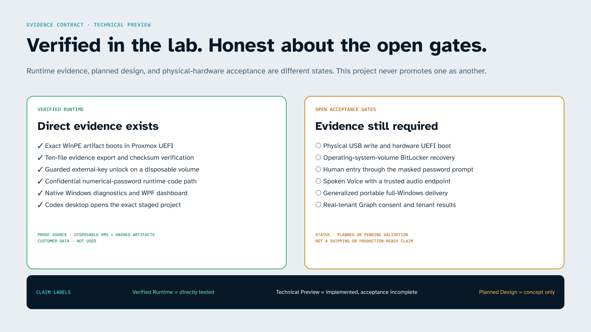
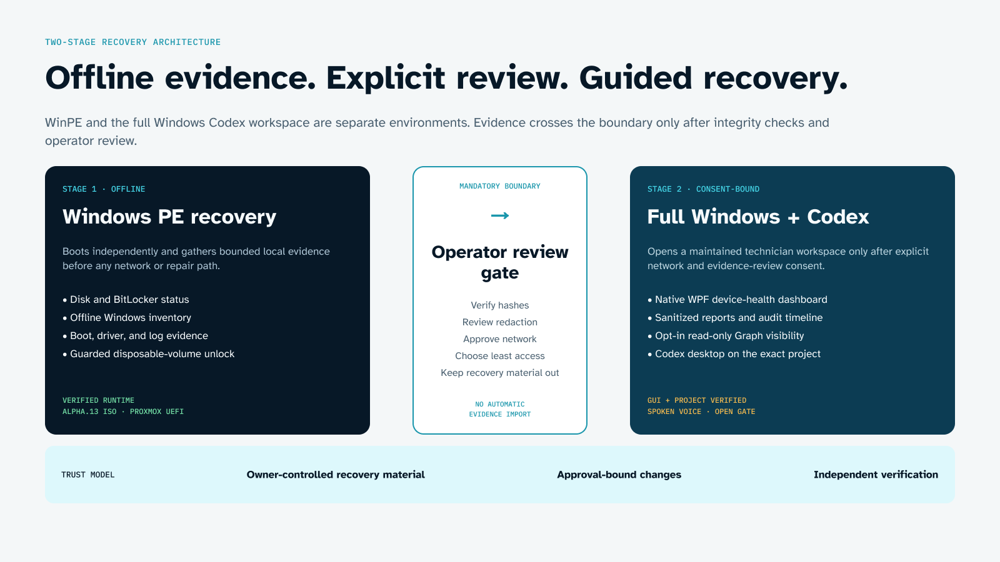
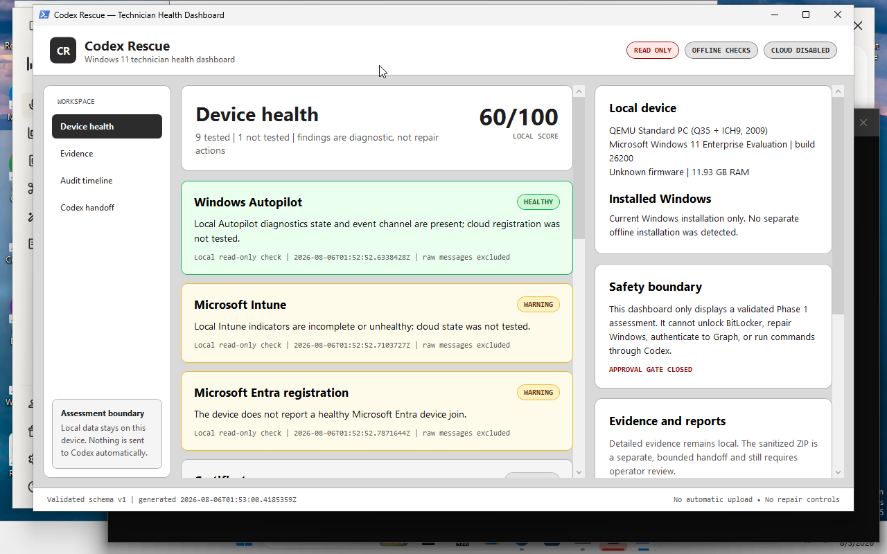

# Codex Rescue USB

[](#current-verification-status)
[](#verify-the-source)
[](LICENSE)
[](#safety-and-trust-model)


> **Independent enterprise technical preview.** Codex Rescue USB is an operator-controlled Windows recovery project for enterprise IT, MSP, and field-service teams. It combines an offline Windows PE evidence stage with a separate full-Windows Codex workspace. It is not affiliated with or endorsed by OpenAI or Microsoft.

Codex Rescue USB is designed for the uncomfortable moment when a Windows computer will not boot, BitLocker is involved, or enrollment and device-management state are unclear. The project makes diagnostic evidence visible before any repair is considered, keeps recovery material out of Codex and exported reports, and places destructive or networked actions behind explicit operator gates.

The repository currently contains a VM-verified WinPE ISO implementation, native full-Windows diagnostics and dashboard, a guarded read-only Microsoft Graph module, a non-destructive fixture console, build and VM-maintenance tools, and an evidence-backed roadmap to physical-media validation.

## Why teams evaluate it

- **Evidence before action.** Inventory disks, Windows installations, boot state, drivers, networking, selected event-log metadata, and BitLocker status without silently changing the target.
- **Two deliberately separate environments.** WinPE handles offline recovery tasks; a maintained full-Windows workspace runs the supported Codex desktop experience after explicit network consent.
- **Recovery keys stay outside the AI boundary.** External-key and numerical-password workflows are local, targeted, and guarded. Recovery material is not logged, exported, committed, or sent to Codex.
- **Bounded enterprise diagnostics.** Local Autopilot, Intune, Entra, TPM, certificate, update, network, driver, and event signals feed a validated report. Optional Graph visibility is delegated, read-only, `GET`-only, and operator-attended.
- **Auditable handoff.** Raw evidence stays local. A separately generated sanitized summary is integrity-checked and requires human review before it can be provided to Codex or a support system.

## Current verification status

| Capability | Current evidence | Boundary |
| --- | --- | --- |
| Fixture safety console | **Verified locally** | Simulation only; no host disk or command access |
| WinPE ISO build and UEFI boot | **Verified in disconnected Proxmox VMs** | Exact alpha.13 artifact; not yet physical USB proof |
| Read-only evidence export | **Verified in WinPE VM** | Prepared destination, exact confirmation, no-overwrite gate |
| BitLocker external-key unlock | **Verified on a disposable encrypted VM data disk** | Not an OS volume or production drive |
| BitLocker numerical-password code path | **Verified with a confidential disposable-VM harness** | Human masked entry and physical hardware remain open |
| Native Windows diagnostics and WPF dashboard | **Verified in Windows VM 111** | Read-only assessment; no repair engine |
| Codex desktop project handoff | **GUI and project verified in Windows VM 111** | Voice control visible; spoken audio not verified |
| Microsoft Graph module | **Native mock/runtime contract verified** | Real tenant consent and live results remain open |
| UEFI boot-repair proposal contract | **Source and fixture contract verified** | Inert plan only; no live discovery or repair execution |
| Physical USB selection guard | **Windows VM and macOS zero-device refusal verified** | Positive write, boot, and real-PC recovery remain open |

**Technical Preview means exactly that:** the project has strong VM and source evidence, but it is not yet a production-supported physical rescue drive. Do not use it as the sole recovery path for customer or irreplaceable data.



*Designed in Figma · status graphic. Every “verified” label maps to repository evidence; the open gates are not presented as completed features.*

## Architecture



*Designed in Figma · product architecture, not a runtime screenshot.*

### Stage 1 — offline Windows PE

The rescue ISO boots into a network-disconnected, read-only-first WinPE environment. From there an operator can inventory the machine, export evidence to one separately prepared destination, and—only on an authorized target—run a guarded BitLocker unlock flow. The ISO contains no customer keys and never needs a key to be stored in the repository.

### Mandatory review gate

The operator verifies the evidence package, checks the target identity, decides what may leave the device, and separately authorizes any network or recovery-key action. No evidence is automatically imported into Codex.

### Stage 2 — maintained full Windows with Codex

Codex runs in a supported full-Windows desktop environment, not inside minimal WinPE. The workspace starts offline, opens the exact project after confirmation, and enables only the selected hardware network adapter through an exact-token command when the operator approves network access. OpenAI currently documents both the [Codex desktop app on Windows](https://openai.com/index/introducing-the-codex-app/) and [Voice with Codex in the desktop app](https://help.openai.com/en/articles/20001275-chatgpt-work-and-codex). Microsoft documents WinPE as a [fixed-purpose deployment and recovery environment](https://learn.microsoft.com/en-us/windows-hardware/manufacture/desktop/winpe-create-apps?view=windows-11); this project does not use the removed Windows To Go model.

## Product tour

### 1. Boot into a clearly bounded recovery environment


**Verified runtime · Proxmox UEFI VM.** The exact alpha.13 ISO reaches the recovery prompt and displays the evidence, destination, and key-handling rules. This is VM boot evidence, not physical USB compatibility.

### 2. Confirm the evidence destination before writing


**Verified runtime · disposable WinPE VM.** Collection requires exactly one prepared destination and the displayed `COLLECT TO <drive>:` token. Existing `CodexRescueEvidence` output is never silently overwritten.

### 3. Run native read-only Windows diagnostics


**Verified runtime · Windows VM 111.** Red and yellow findings are diagnostic outcomes, not permission to repair. Cloud state is not inferred from local signals.

### 4. Review the assessment in a technician-focused dashboard



**Verified runtime · Windows VM 111.** The native WPF dashboard validates the report schema before rendering, exposes no repair control, and keeps cloud access disabled.

### 5. Hand a reviewed summary to Codex


**Verified runtime · privacy-cropped Windows VM 111.** The project and Voice control are visible. The VM had no audio endpoint, so this does not claim a spoken Voice session. The screenshot’s full-access setting is from a disposable build VM and is not the recommended recovered-device default.

## Install and update

Codex Rescue USB has three installation profiles. Choose only the profile needed for the job; installing the fixture console does not create a bootable ISO, and building an ISO does not prove a physical USB.

| Profile | Use it for | Required environment |
| --- | --- | --- |
| Fixture evaluation | Learn the safety, proposal, approval, and audit workflow | macOS, Linux, or Windows; Git and Python 3.10+ |
| Recovery-media builder | Build and verify the WinPE ISO | Dedicated Windows 11 x64 VM/workstation; elevated PowerShell; ADK Deployment Tools and matching WinPE add-on |
| Technician workspace | Run native diagnostics, dashboard, sanitized handoff, Codex, network consent, and optional Graph checks | Maintained full Windows 11 x64; PowerShell 7 recommended; Codex installed separately |

### First installation

Clone the public repository and stay on the published `main` branch:

```bash
git clone https://github.com/Morlock52/codex-rescue-usb.git
cd codex-rescue-usb
git switch main
```

Inspect the current revision before using recovery media:

```bash
git status --short --branch
git log -1 --oneline
```

On a Windows build VM, open an elevated PowerShell window in the repository and audit the host before installing or changing tools:

```powershell
Set-ExecutionPolicy -Scope Process Bypass
.\scripts\Test-TechnicianWorkspacePrerequisite.ps1 -AsJson
```

For the established build-VM path, install or update the bounded developer toolchain and ADK servicing package only after reviewing the script output and applicable licenses:

```powershell
.\scripts\Install-BuildVmToolchain.ps1 -Confirm:$false
.\scripts\Install-AdkServicingUpdate.ps1 -Confirm:$false
```

The repository does not redistribute Windows, WinPE, Codex, Microsoft Graph modules, recovery keys, or customer data. Obtain Microsoft and OpenAI software through their supported channels and terms.

### Provision a clean technician workspace

For the portable full-Windows workspace, audit first and review the plan before applying anything:

```powershell
.\scripts\Test-TechnicianWorkspacePrerequisite.ps1 -AsJson
.\scripts\Install-TechnicianWorkspaceGuestAgent.ps1 -Mode Audit -AsJson
.\scripts\Install-TechnicianWorkspaceToolchain.ps1 -Mode Plan -AsJson
```

When the live prerequisite audit passes, the attached VirtIO media and signer are verified, and you accept the applicable package agreements, use the exact guarded apply flows:

```powershell
.\scripts\Install-TechnicianWorkspaceGuestAgent.ps1 `
  -Mode Apply `
  -MediaRoot 'E:\' `
  -ConfirmationToken 'INSTALL QEMU GUEST AGENT'

.\scripts\Install-TechnicianWorkspaceToolchain.ps1 `
  -Mode Apply `
  -ConfirmationToken 'INSTALL CODEX RESCUE TOOLCHAIN' `
  -PackageAgreementsApproved
```

Replace `E:\` only after verifying the attached VirtIO ISO. The installers do not sign in to Codex or Graph and do not place credentials in the image. Before generalizing or snapshotting the VM, disconnect its network, remove temporary authentication, and run:

```powershell
.\scripts\Test-TechnicianWorkspaceToolchain.ps1 -AsJson
```

### Update an existing installation

Never discard local work just to update. Inspect the checkout first:

```bash
git status --short --branch
git log -1 --oneline
```

If the worktree is clean, update without creating a merge commit:

```bash
git switch main
git pull --ff-only
```

If `git status` shows changes, commit them to a separate branch or back them up before updating. Do not use a destructive reset on a recovery project. After pulling:

1. read the changed README, security model, and verification evidence;
2. rerun the source verification commands below;
3. rerun `Test-TechnicianWorkspacePrerequisite.ps1` on Windows;
4. check Microsoft’s current ADK and servicing guidance;
5. rebuild the ISO instead of treating an older artifact as updated; and
6. boot-test and record the exact new ISO SHA-256 in a disconnected disposable VM.

An ISO is immutable. Updating the Git checkout does not modify an existing ISO or USB drive.

### Verify the installation

Run the cross-platform source checks from the repository root:

```bash
python3 -W error::ResourceWarning -m unittest discover -s tests -v
python3 -m compileall -q src tests
node --check web/assets/app.js
```

On the Windows builder, verify a newly created ISO separately:

```powershell
.\scripts\Test-RescueIso.ps1 -IsoPath '.\dist\Codex-Rescue-ISO.iso'
```

A passing source suite validates checked-in contracts. Only the ISO verifier and a booted disposable VM validate that particular ISO; neither validates a physical USB.

## Feature use reference

The table is the shortest route to every implemented operator-facing feature. Detailed safety explanations and expected results follow in the linked guides.

| Feature | Start it | Expected result | Important boundary |
| --- | --- | --- | --- |
| Fixture safety console | `PYTHONPATH=src python3 -m codex_rescue --port 8080` | Loopback web console with simulated proposal, approval, execution, and audit | Simulation only; cannot inspect or repair the host |
| Build-VM audit and repair | `scripts\Repair-BuildVm.cmd` | Non-secret health and tool evidence, plus explicitly bounded maintenance | Not target-PC repair and never proof of ISO boot |
| Build developer toolchain | `.\scripts\Install-BuildVmToolchain.ps1 -Confirm:$false` | Signed WinGet installs/updates for the allowlisted build tools | Review licenses and existing installations first |
| Guest-agent audit/install | `.\scripts\Install-TechnicianWorkspaceGuestAgent.ps1 -Mode Audit -AsJson` | Verifies attached VirtIO media and optionally installs QEMU-GA with an exact phrase | Apply is Windows-only, elevated, and never downloads media |
| Portable workspace plan/install | `.\scripts\Install-TechnicianWorkspaceToolchain.ps1 -Mode Plan -AsJson` | Reviews or installs the allowlisted Windows/PowerShell/Codex CLI toolchain | Apply needs live prerequisites, license approval, and exact consent |
| Workspace verification | `.\scripts\Test-TechnicianWorkspaceToolchain.ps1 -AsJson` | Read-only readiness and no-persisted-auth report | Fixture success is not live image readiness |
| Build and verify ISO | `.\scripts\Build-RescueIso.ps1 -Force` | `dist\Codex-Rescue-ISO.iso` plus verification JSON | Build success is not physical-media acceptance |
| Offline WinPE evidence | `X:\Rescue\Collect-RescueEvidence.cmd` | Ten-file evidence package on one prepared second drive | Requires exact destination token; refuses overwrite |
| BitLocker external key | `X:\Rescue\Unlock-BitLockerWithRecoveryKey.cmd E` | Authorized unlock attempt for one verified disposable target | Recovery material stays local and outside Codex |
| BitLocker numerical password | `Unlock-BitLockerWithRecoveryPassword.ps1` with exact target/token | Masked local entry for one verified disposable target | Human entry and production OS volumes are not accepted yet |
| Full-Windows assessment | `.\scripts\Invoke-CodexRescueReadOnlyAssessment.ps1` | Detailed local report and separate sanitized ZIP | Read-only; sanitized output still needs review |
| Technician dashboard | `.\scripts\Open-CodexRescueDashboard.ps1` | Schema-validated WPF findings dashboard | Findings are not repair approval |
| Sanitized evidence summary | `.\scripts\New-CodexEvidenceSummary.ps1` | Aggregate Markdown handoff outside raw evidence | Rejects key material; operator review remains mandatory |
| Codex workspace | `.\scripts\Open-CodexRecoveryWorkspace.ps1` | Audited, exact-project Codex desktop launch | Full Windows only; no automatic evidence upload |
| Offline-at-startup policy | `.\scripts\Set-CodexRecoveryOfflineStartup.ps1 -Action Audit` | Audits, installs, or removes the exact-adapter startup task | Install/remove need elevation, adapter identity, and exact token |
| Recovery network consent | `.\scripts\Set-CodexRecoveryNetwork.ps1 -Action Audit` | Exact-adapter audit, enable, or disable flow | Never guesses an interface; enable needs a target-bound token |
| Read-only Graph view | Import `CodexRescue.Graph.psd1` and connect with the exact phrase | Allowlisted delegated `GET` checks | Real-tenant acceptance pending; no recovery-key retrieval |
| UEFI repair proposal | `.\scripts\New-CodexRescueUefiBootRepairPlan.ps1` | Target fingerprint, proposal digest, rollback contract, and inert JSON plan | Source/fixture contract only; execution is unavailable |
| Windows USB readiness | `scripts\Open-PhysicalUsbReadinessGui.cmd` | ISO/disk identity and optional no-write JSON plan | Does not erase, format, or write the USB |
| macOS USB readiness | `python3 scripts/physical_usb_readiness_macos.py --iso <path>` | Equivalent no-write audit and target-bound token | Positive physical path is still unverified |

### Use the inert UEFI boot-repair proposal

This feature is the first non-simulated boot-repair design contract, but it deliberately stops before live discovery, approval, or execution. It accepts only a secret-free schema-v1 discovery contract whose Windows and FAT32 EFI volumes resolve to the same disk, whose BitLocker state is already `Unlocked`, and whose EFI Microsoft boot-directory backup is verified and restore-tested.

Generate a console-only JSON proposal from a lab fixture:

```powershell
.\scripts\New-CodexRescueUefiBootRepairPlan.ps1 `
  -ContractFixturePath '.\lab\uefi-discovery-contract.json' `
  -AsJson
```

Save a new proposal without overwriting an earlier review artifact:

```powershell
.\scripts\New-CodexRescueUefiBootRepairPlan.ps1 `
  -ContractFixturePath '.\lab\uefi-discovery-contract.json' `
  -OutputPath '.\lab\uefi-boot-repair-plan.json'
```

The output always records `PlanOnly: true`, `LiveEvidence: false`, `ReadyForApproval: false`, `ExecutionAvailable: false`, and `WritePerformed: false`. It describes a tightly bound `bcdboot.exe <WindowsDirectory> /s <EfiPartition> /f UEFI /v` proposal as data; it never launches that command. See the [UEFI boot-repair proposal contract](docs/reference/uefi-boot-repair-proposal.md) for a complete input example, rejection rules, rollback requirements, and the remaining live-VM gates.

## Five-minute safe evaluation

This quick start runs only the bundled fixture console. It is the fastest way to evaluate the safety and approval model without Windows ADK, a VM, or a USB drive.

### macOS or Linux

```bash
git clone https://github.com/Morlock52/codex-rescue-usb.git
cd codex-rescue-usb
PYTHONPATH=src python3 -m codex_rescue --port 8080
```

### Windows PowerShell

```powershell
git clone https://github.com/Morlock52/codex-rescue-usb.git
Set-Location .\codex-rescue-usb
$env:PYTHONPATH = 'src'
python -m codex_rescue --port 8080
```

Open `http://127.0.0.1:8080`. Select the **Boot loop** fixture, review the proposal, approve the exact simulated plan, and run the safe simulation. Then open the hash-chained audit record. The locked-BitLocker and failing-drive fixtures intentionally stop rather than inventing an unsafe repair.

The server binds to loopback, uses Python’s standard library, contacts no model or cloud service, and cannot run host repair commands. Audit records are written under `~/.codex-rescue/cases` by default.

For a guided walkthrough and expected results, see [Evaluate the fixture console](docs/guides/evaluation.md).

## Three operator examples

### Enrollment or Autopilot triage

1. Run the default full-Windows local assessment while offline.
2. Compare local Autopilot, Intune, Entra, certificate, TPM, update, and event signals.
3. Open the validated report in the dashboard.
4. Only if tenant data is necessary, obtain operator consent and use the separate read-only Graph module with an appropriately authorized technician account.

**Result:** local evidence remains useful even when the tenant is unreachable. A missing local signal is never presented as confirmed cloud state, and a Graph permission error is not relabeled as a device failure.

### Boot and BitLocker triage

1. Boot the exact verified ISO with networking disconnected.
2. Collect disk, BCD, driver, event-index, offline-installation, and BitLocker status to a separate prepared evidence drive.
3. Review the destination identity and package hashes.
4. If the owner has authorized unlock, use only the explicit target-volume workflow and enter recovery material locally. Never paste a recovery password into Codex, a ticket, or a transcript.

**Result:** the operator can distinguish “locked,” “unhealthy media,” and “boot configuration” before proposing action. The current proof covers disposable data volumes, not production OS-volume recovery.

### Evidence-assisted Codex troubleshooting

1. Generate the sanitized aggregate summary outside the raw evidence directory.
2. Review the summary and its privacy declarations manually.
3. Start the maintained full-Windows Codex workspace with the least access needed.
4. If network access is required, enable only the audited adapter through the exact consent command.
5. Attach or open only the reviewed summary—never raw evidence or recovery material.

**Result:** Codex can help reason over bounded facts while the operator retains control over data disclosure and every repair decision.

## Build the recovery ISO

Use a dedicated Windows 11 x64 build VM or workstation with the Windows ADK **Deployment Tools**, matching WinPE add-on, and the latest applicable Microsoft ADK servicing update. The project’s validated Proxmox builder uses 4 vCPU, **12 GB fixed RAM**, and at least 30 GB of free system-drive space. Eight GB is the VM-validated build-only floor; 12 GB is recommended when ADK, Codex, editors, and coding tools share the machine.

```powershell
Set-ExecutionPolicy -Scope Process Bypass
.\scripts\Install-AdkServicingUpdate.ps1 -Confirm:$false
.\scripts\Build-RescueIso.ps1 -Force
```

The builder injects only the checked-in rescue scripts plus Microsoft WinPE optional components, creates `dist\Codex-Rescue-ISO.iso`, and immediately writes a verification report containing the exact size, SHA-256, boot payload checks, injected-source hashes, and required-package checks.

Microsoft’s current guidance changes over time. Recheck the official [ADK download page](https://learn.microsoft.com/en-us/windows-hardware/get-started/adk-install) and [ADK servicing updates](https://learn.microsoft.com/en-us/windows-hardware/get-started/adk-servicing) immediately before each build. The verified alpha.13 build used ADK `10.1.26100.2454` serviced with `KB5101684`; that historical validation does not waive current servicing requirements.

Follow the complete [ISO build and VM validation guide](docs/guides/build-guide.md). Do not write physical media until the ISO’s verification JSON and a separate disconnected UEFI VM boot both pass.

### Audit a future USB target from macOS without writing it

The current Mac can perform the same no-write identity gate as the Windows readiness GUI. Connect only the intended blank USB and run:

```bash
python3 scripts/physical_usb_readiness_macos.py \
  --iso /path/to/Codex-Rescue-ISO-v0.1.0-alpha.13-67E79C37.iso
```

The command requires the alpha.13 SHA-256 by default and exactly one external, physical, writable USB whole disk. It prints the ISO and disk identity plus a target-bound confirmation token. It does not unmount, erase, partition, format, or write the USB and does not launch a writer. An optional JSON readiness plan can be saved only to internal non-target storage after a second full revalidation and the exact displayed token. The positive USB path remains unverified until disposable hardware is attached.

## Safety and trust model

The project treats technical capability and authorization as different things.

- **Read-only is the default.** Collection and diagnosis do not imply repair authority.
- **Exact targets and phrases.** Sensitive operations bind approval to the displayed target and current plan.
- **No secret ingestion.** Recovery passwords, `.bek` material, access tokens, customer documents, and raw tenant responses are outside the Codex handoff contract.
- **No automatic upload.** Raw evidence stays local. Sanitized output is a separate artifact and still needs review.
- **Offline at startup.** The maintained workspace can enforce an exact-adapter offline boot policy; enabling networking is a separate consent event.
- **Fail closed.** Ambiguous targets, changed destinations, existing packages, missing rollback evidence, secret-bearing proposals, and unsupported actions are rejected.
- **Evidence labels are literal.** Fixture, source test, VM runtime, physical hardware, and production acceptance are never treated as interchangeable proof.

Read the full [security and data-boundary model](docs/reference/security-model.md) before testing encrypted media. Report vulnerabilities privately using [SECURITY.md](SECURITY.md).

## Roadmap

| Phase | Goal | Current state | Exit evidence |
| --- | --- | --- | --- |
| 1. Safe evaluation | Fixture console, explicit approvals, immutable receipts, audit chain | **Complete at source-test level** | Cross-platform tests and local fixture walkthrough |
| 2. Offline evidence media | Build, verify, and boot WinPE; collect bounded evidence | **VM verified** | Exact ISO hash, disconnected UEFI boot, package integrity, no-overwrite proof |
| 3. Technician workspace | Native assessment, dashboard, bounded Codex handoff, network and Graph gates | **VM verified with noted open gates** | Validated reports, GUI evidence, exact-project launch, least-privilege and tenant/audio acceptance still open |
| 4. Guarded repairs | Target-bound proposal, approval, rollback, execution, and independent post-action verification | **In progress** | Inert UEFI proposal contract is source verified; live discovery/executor and disposable-VM repair/rollback remain open |
| 5. Physical release candidate | Write disposable USB and validate representative physical PCs | **Blocked by hardware acceptance, intentionally skipped for now** | Recorded writer identity, physical UEFI/Secure Boot boot, evidence export, disposable BitLocker test, rollback, owner acceptance |

The active software milestone is Phase 4: connect the inert UEFI proposal to read-only live discovery, prove a restore-tested EFI backup, then design a separately gated executor for a disposable disconnected VM. Mac writing and physical hardware do not block that software work, but they remain mandatory before any production-ready claim. The detailed task sequence is in the [recovery-media roadmap](docs/plans/2026-08-05-recovery-media-roadmap.md).

## Documentation

| Start here | Purpose |
| --- | --- |
| [Evaluation guide](docs/guides/evaluation.md) | Run the safe fixture demo and understand the approval contract |
| [Operator guide](docs/guides/operator-guide.md) | Use WinPE evidence, Windows diagnostics, dashboard, Codex handoff, and optional Graph checks |
| [Build guide](docs/guides/build-guide.md) | Prepare the Windows builder, create and verify the ISO, and test it in Proxmox |
| [Architecture](docs/reference/architecture.md) | Understand the two-stage environment, trust boundaries, and data flow |
| [Verification evidence](docs/reference/verification-evidence.md) | Review exact VM milestones, artifact identity, and open acceptance gates |
| [Security model](docs/reference/security-model.md) | Review threats, secrets policy, approvals, networking, and evidence handling |
| [UEFI boot-repair proposal](docs/reference/uefi-boot-repair-proposal.md) | Review the inert schema, rejection rules, target binding, rollback contract, and open live gates |
| [Recovery-media roadmap](docs/plans/2026-08-05-recovery-media-roadmap.md) | See the phased path from technical preview to physical release evidence |
| [README product system in Figma](https://www.figma.com/design/sW9ctJbQnpgzx0DqJqwnbo) | Open the source frames for the hero, architecture, and evidence-status graphics |

## Verify the source

```bash
python3 -W error::ResourceWarning -m unittest discover -s tests -v
python3 -m compileall -q src tests
node --check web/assets/app.js
```

The current repository passes **129 tests**. Tests prove the checked-in safety contracts and local behavior; they do not substitute for physical USB, hardware, tenant, audio, or production-data acceptance tests.

## Support, contribution, and license

- Use [GitHub Issues](https://github.com/Morlock52/codex-rescue-usb/issues) for reproducible bugs and bounded feature requests. Do not include recovery keys, tokens, tenant identifiers, customer files, or raw evidence.
- Read [SUPPORT.md](SUPPORT.md) for the support boundary and evidence-safe issue checklist.
- Read [CONTRIBUTING.md](CONTRIBUTING.md) before changing recovery, networking, evidence, or authorization behavior.
- Security reports follow [SECURITY.md](SECURITY.md), not public issues.
- Licensed under [Apache License 2.0](LICENSE). Third-party Microsoft and OpenAI software, services, trademarks, and license terms remain their owners’ responsibility and are not redistributed by this repository.

---

**Independent project notice:** Codex Rescue USB is an independent open-source project. “Codex,” “Windows,” “WinPE,” “BitLocker,” “Intune,” “Entra,” and related marks belong to their respective owners. This project is not affiliated with, sponsored by, or endorsed by OpenAI or Microsoft.
