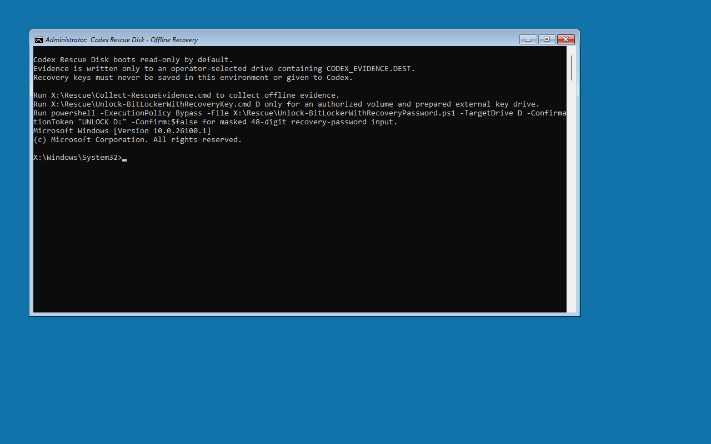
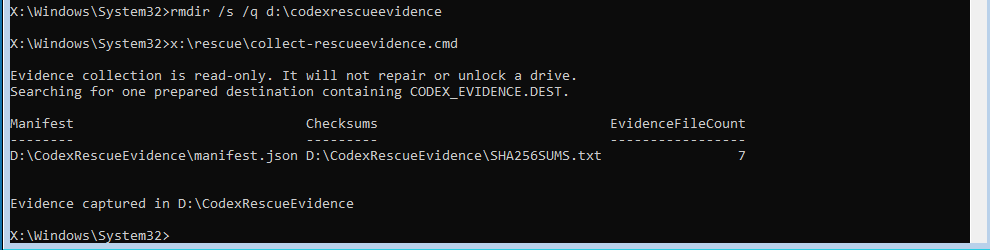
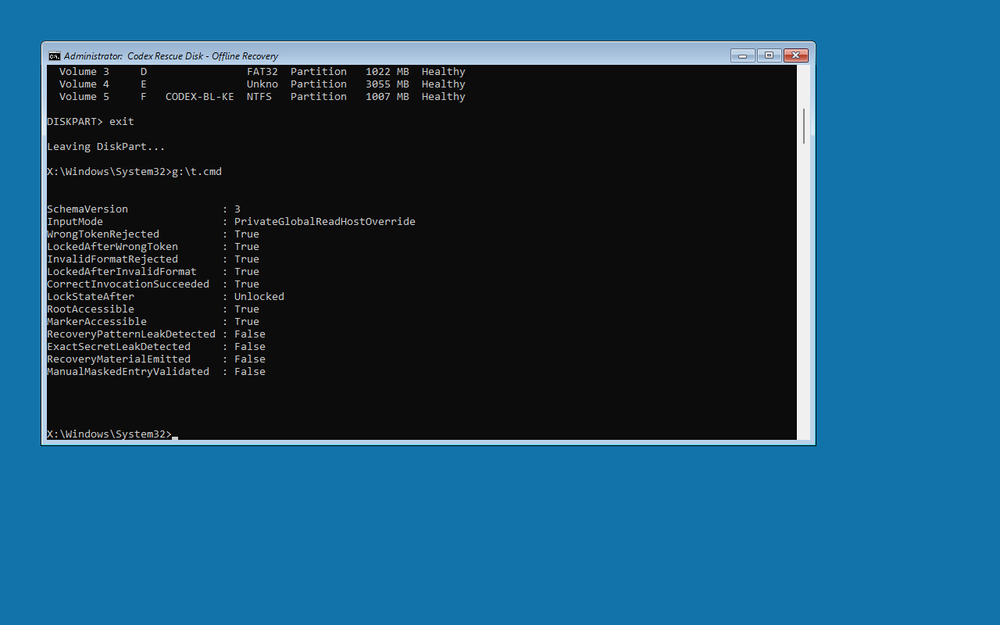
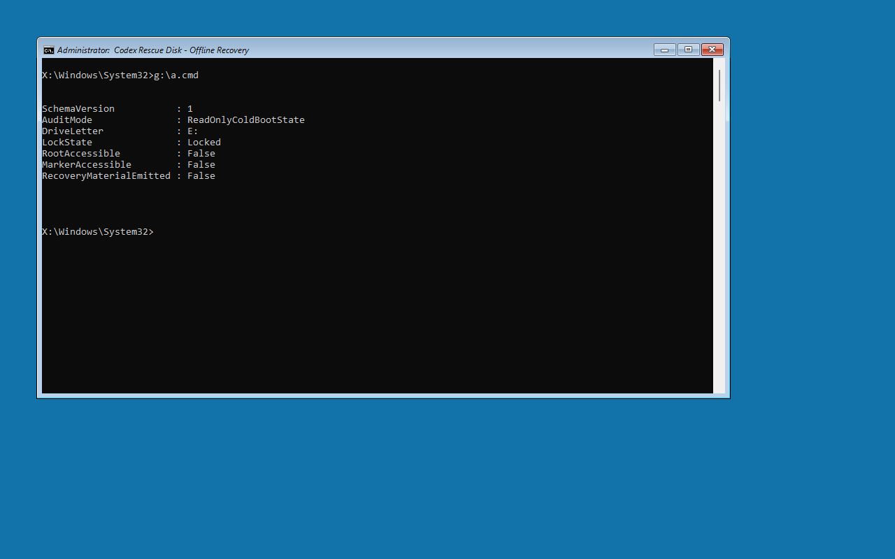

# Codex Rescue USB

> A safety-first recovery project with a fixture console and a VM-verified Windows PE recovery ISO.

Codex Rescue USB contains two deliberately separate deliverables: a host-runnable fixture console that demonstrates the approval model without touching a real PC, and a Windows PE image that has booted in a disposable UEFI VM, exported read-only troubleshooting evidence, completed a guarded external recovery-key unlock, and completed a lab-confidential numerical recovery-password unlock against disposable BitLocker data volumes.

The verified Windows PE milestones are real VM evidence. They are not proof of physical USB compatibility, operator-typed masked recovery-password entry, operating-system-volume recovery, real repair, a spoken Voice session, or a portable full-Windows workspace. Those claims remain gated until their own tests exist.

## Verified WinPE milestones

On August 5, 2026, the source was built with the serviced Windows ADK and booted in a separate disposable Proxmox UEFI VM using Windows UEFI CA 2023 keys. Five exact artifacts preserve the evidence boundary between the original read-only export test, the external BitLocker recovery-key test, the clock-trust hardening, the confidential numerical recovery-password code-path test, and the clean post-fix build:

| Milestone | Exact artifact | Size | SHA-256 |
| --- | --- | ---: | --- |
| Read-only evidence export | `Codex-Rescue-ISO-v0.1.0-alpha.4.iso` | 557,518,848 bytes | `F7F6E3570F0DBF264D56CAAF8703C6FB6EAD99ABB53FDC420D9B4737C9584DFA` |
| Integrated BitLocker status export and guarded external-key unlock | `Codex-Rescue-ISO-v0.1.0-alpha.7.iso` | 558,286,848 bytes | `A4FF89AD4FBF1BEB6BAECA4B92387F0153754B270BA3DF897DA11C99812DE947` |
| Explicit evidence-clock trust | `Codex-Rescue-ISO-v0.1.0-alpha.9.iso` | 558,243,840 bytes | `7080E6D51AFADDD6531390FA8A6EDECE8AFCF1AC419FECE36E0C4EE96C087D29` |
| Confidential numerical recovery-password runtime validation; startup banner superseded | `Codex-Rescue-ISO-v0.1.0-alpha.10-94CE0A74.iso` | 558,180,352 bytes | `94CE0A744855FA777E54BC5B9CE2609D3BD7BE6D8A0121B30D09BE35CCCAD46C` |
| Clean post-fix ADK build, payload verification, and latest UEFI boot | `Codex-Rescue-ISO-v0.1.0-alpha.12-5E2E1F90.iso` | 557,871,104 bytes | `5E2E1F90765DF00BAA3F9EA66282DBB4A1C981B87FBCAD9C6533ABF66AC58089` |

The first three artifacts used the same 4-vCPU, 8-GB Windows 11 build VM with ADK 10.1.26100.2454 plus KB5101684. The VM is now sized at 10 GB fixed RAM for ADK, Codex, and development work. The isolated test VM used 2 vCPU, 2 GB RAM, UEFI, Windows UEFI CA 2023 keys, disconnected networking, and disposable virtual disks.

The alpha.4 evidence test verified all of the following:

- UEFI recognized the ISO as bootable media and WinPE reached the Codex Rescue command prompt.
- The startup banner accurately described the read-only default and recovery-key boundary.
- Export stopped without writing when no prepared destination existed.
- Export refused to overwrite an existing `CodexRescueEvidence` directory.
- With exactly one prepared test destination, export produced the expected evidence package.
- The image's supported WinPE PowerShell components generated `manifest.json` and `SHA256SUMS.txt` after revalidating the prepared destination.
- A separate Proxmox-side read-only mount verified all nine package files, all eight listed hashes, the seven-entry manifest schema, and the successful DISM driver inventory.

Alpha.4 did **not** have `WinPE-SecureStartup`; its `bitlocker-status.txt` recorded that `manage-bde` was not recognized. The destination, no-overwrite, manifest, checksum, and other diagnostic gates above remain valid alpha.4 evidence, but alpha.4 is not BitLocker-status proof. The exact alpha.7 image corrected that integration gap.

The alpha.7 BitLocker test then verified all of the following:

- WinPE booted the exact alpha.7 image with `WinPE-SecureStartup` present.
- A 3-GiB disposable data disk was 100% BitLocker-encrypted with XTS-AES 128 and locked before WinPE started.
- A separate 1-GiB disposable key disk held the local marker and exactly one hidden external `.bek` recovery-key file.
- At runtime, the command accepted only the explicit disposable `E:` target, found exactly one prepared key drive and key file, and required the operator to type `UNLOCK E:`. The checked-in safety tests separately assert that ordinary `C:` and WinPE `X:` are absent from the target allowlist.
- The native unlock output was suppressed so the key filename and key contents did not appear in the console capture, evidence package, source tree, or GitHub.
- WinPE reported the selected data volume as unlocked, its root was accessible, and the known non-secret fixture file read `Codex Rescue disposable BitLocker fixture. No customer data.`
- A cold VM restart discarded the unlock session and the same guard reported `Lock Status: Locked`; the test VM was then stopped.
- A later cold alpha.7 boot replaced only the copied disposable evidence package and reran the collector. All eight listed hashes passed from a separate read-only Proxmox mount; `bitlocker-status.txt` contained a real volume/status block; and no `.bek` file or recovery-password-shaped text existed in the package.

The alpha.9 clock-trust test then verified all of the following:

- The exact alpha.9 artifact reached the read-only Codex Rescue command prompt in the disconnected UEFI VM.
- The no-overwrite guard first refused the archived disposable alpha.7 package.
- After only that archived fixture package was removed, alpha.9 created a fresh nine-file package.
- A separate Proxmox read-only VFAT mount verified all eight listed hashes, exactly nine package files, manifest schema 1, `ClockSource: WinPE system clock`, and `ClockExternallyValidated: false`.
- No `.bek` file or 48-digit recovery-password-shaped text existed in the package.
- The redacted-summary generator verified the real alpha.9 package, counted one BitLocker volume/status block, and passed valid scans for private addresses, MAC addresses, volume paths, key-file suffixes, and recovery-password patterns.

The alpha.10 confidential runtime test then verified all of the following:

- The exact alpha.10 artifact above reached its disconnected WinPE prompt, contained the required WinPE packages, and embedded the checked-in recovery-password script with SHA-256 `7CEE6A57B1C42837AD7C3FBD54688F6554A904439B78C7598A6D3474AC392CE9`.
- A private in-process harness invoked that exact script with `-ExecutionPolicy Bypass` and supplied a new lab-only password through a temporary `Read-Host` override. The password was not placed on a command line, piped through standard input, copied to Git, or shown in the approved captures.
- The exact confirmation gate rejected a wrong token; format validation rejected malformed input; a valid but wrong password left the volume locked; and the correct disposable password unlocked only the selected `E:` volume.
- The known non-secret marker became readable only after the correct unlock. A cold power cycle then returned the volume to `Locked`, with both the volume root and marker inaccessible.
- Pattern and exact-secret scans of the captured streams were false, and the harness emitted no recovery material. A prior disposable fixture and its accidental local-only secret-bearing screenshot were destroyed immediately; neither customer data nor a real recovery credential was involved.

The alpha.12 clean-build test then verified all of the following:

- A full Microsoft ADK build ran in isolated Windows VM 115 from source whose six embedded WinPE file hashes, build-script hash, and verifier-script hash exactly match repository commit `BB6EDA4E740A63F1A76517E30156C405793141F0`.
- `Test-RescueIso.ps1` independently matched all six embedded files to source; required BIOS and UEFI boot payloads; and installed WinPE-WMI, WinPE-SecureStartup, WinPE-NetFx, WinPE-Scripting, and WinPE-PowerShell packages.
- The success JSON has SHA-256 `E8DD19331701B3017812C7E25E1E63F70CE403D2110815C81EC674C1FB42D419`, records `ContainsRecoveryMaterial: false`, and marks its Windows build-environment clock as externally unvalidated.
- A second hash check matched the report's exact ISO size and SHA-256. The hash-named ISO and report were copied through the dedicated `CODEX-ISO-XFER` disk and matched again in private Proxmox storage.
- That exact ISO visibly reached the corrected offline prompt in VM 114 with 2 vCPU, 2 GiB RAM, OVMF with Windows UEFI CA 2023 keys, no data disks, and `link_down=1`.

This verifies the external recovery-key path and the numerical recovery-password code path on disposable virtual media. The numerical test used a confidential automated input boundary, so it does **not** prove the operator-typed masked prompt. Physical USB boot, operating-system-volume recovery, production-data access, decryption, protector changes, repair of Windows, and spoken Voice also remain separately gated phases.

### Real VM-boot screenshot


Captured from the exact alpha.4 SHA-256 artifact above. This is real Proxmox VM evidence, not a Figma concept or fixture-console image.

### Real alpha.9 boot screenshot


Captured from the exact alpha.9 SHA-256 artifact above on the disconnected 2-vCPU, 2-GB UEFI validation VM. The test VM was stopped after the independent package inspection.

### Real alpha.12 clean-build boot screenshot



Captured from the exact alpha.12 SHA-256 artifact above in disconnected UEFI VM 114 after its post-build source, payload, package, size, and hash verifier passed. This proves VM bootability of that exact artifact, not physical USB compatibility.

### Real no-overwrite screenshot


The final ISO found the prepared test destination and stopped because a prior package already existed.

### Real evidence-export screenshot


After only the disposable prior package was removed, the same final ISO exported a fresh package to the prepared test destination.

### Real alpha.7 integrated evidence screenshot



This privacy crop shows the exact alpha.7 collector replacing only the copied disposable package and producing its seven-entry manifest plus checksum file. A separate read-only mount verified every listed hash and confirmed that the BitLocker status command was present. The crop excludes the disposable volume serial number.

### Real BitLocker authorization screenshot


Captured from the exact alpha.7 artifact. The command selected only disposable volume `E:`, found one separately prepared key drive and one key file, hid the key filename and contents, showed the locked state, and stopped for the exact `UNLOCK E:` confirmation.

### Real BitLocker unlock screenshot


After the exact confirmation, WinPE reported the disposable `CODEX-BL-TEST` volume as 100% encrypted, protection on, and unlocked. The expected minimal-WinPE system-device warning is shown and is not treated as the unlock result; the script separately verified that the selected root became accessible.

### Real disposable-file verification screenshot


The known fixture file was read from the unlocked volume and contained no customer data. A cold restart then returned the volume to `Lock Status: Locked`; the unlock was not left active.

### Real numerical recovery-password runtime screenshot



Captured from the exact alpha.10 artifact above in the disconnected disposable VM. The private harness exercised the checked-in production script and reports only booleans and non-secret state. `ManualMaskedEntryValidated: False` is intentional: this proves the guarded runtime code path, not a human typing into the masked prompt.

### Real numerical recovery-password cold-relock screenshot



After a full VM power cycle, a separate read-only auditor found the volume locked, its root and marker inaccessible, and no recovery material emitted. The auditor had no unlock operation and contained no recovery password.

### Artifact availability and Microsoft licensing

The repository and GitHub pre-releases publish the original Codex Rescue source, reproducible build instructions, screenshots, verified artifact sizes, and SHA-256 values—not the Microsoft-built ISO binaries. The Windows ADK license installed on the verified build VM permits using WinPE to install and recover Windows, but prohibits publishing the Microsoft software for others to copy. Build the ISO locally from a properly licensed ADK installation and verify the resulting artifact in a disposable VM. The exact ISO artifacts identified above are retained privately on the Proxmox host for controlled validation.

## Building the bootable ISO (Windows build VM)

The checked-in source includes the first WinPE ISO build assets. Build it on a Windows 11 x64 VM or workstation with:

- Windows ADK **Deployment Tools**;
- the matching Windows PE add-on; and
- the current Microsoft ADK servicing patch for that ADK release.

The build script adds Microsoft's WinPE-WMI, WinPE-SecureStartup, WinPE-NetFx, WinPE-Scripting, and WinPE-PowerShell optional components in dependency order. SecureStartup supplies Microsoft's BitLocker management support; the remaining components provide the supported local hashing path used for the evidence manifest. No third-party executable is embedded.

Microsoft currently lists ADK 10.1.26100.2454 for general x64 Windows 10/11 recovery work and requires that release to be serviced with KB5079391 or later. The verified build used KB5101684. Check the [current ADK download page](https://learn.microsoft.com/en-us/windows-hardware/get-started/adk-install) and [ADK servicing updates](https://learn.microsoft.com/en-us/windows-hardware/get-started/adk-servicing) immediately before building; the update named in this repository was current on August 5, 2026.

The helper below downloads only from Microsoft-owned hosts, rejects an MSP unless Windows reports a valid Microsoft Authenticode signature, installs applicable patches, and records package hashes and installer results under `C:\CodexRescueVmAudit\ADK-Servicing`:

```powershell
.\scripts\Install-AdkServicingUpdate.ps1 -Confirm:$false
```

Then open an elevated Windows PowerShell session and run:

```powershell
Set-ExecutionPolicy -Scope Process Bypass
.\scripts\Build-RescueIso.ps1 -Force
```

For the same build with a visible completion prompt, double-click `scripts\Build-RescueIso.cmd`.

For Proxmox guest-agent automation, run `scripts\Build-RescueIso-Unattended.cmd`. It writes the complete console output and numeric exit code into `dist` so a timed-out management session does not lose the build result.

### Staging source from a Proxmox virtual CD

When the repository is mounted in the build VM as a read-only virtual CD, open the CD in File Explorer and double-click `scripts\Stage-RescueSource.cmd`. It creates `Documents\CodexRescue` and copies the source there without changing the CD. If that destination already exists, the launcher stops without overwriting it. Open PowerShell in the staged folder and run the build command above.

This produces `dist\Codex-Rescue-ISO.iso` using Microsoft's `/bootex` option and Windows UEFI CA 2023-signed boot files. The build then runs `scripts\Test-RescueIso.ps1`, which records the exact ISO size and SHA-256 in `Codex-Rescue-ISO.iso.verification.json`; requires the BIOS and UEFI boot payload files; mounts `boot.wim` read-only; verifies every embedded Codex Rescue file against the checked-in source; and confirms all required WinPE packages are installed. A failed verification removes any older success report for that output path.

That JSON proves artifact identity and payload consistency, not bootability. Attach the exact ISO to a separate Proxmox test VM and verify it reaches the WinPE command prompt before using physical hardware. The build VM is not the test VM. A legacy Windows UEFI 2011 CA build is a separate compatibility choice and must be matched to the target device's Secure Boot revocation state.

### Repairing and auditing the Proxmox build VM

The repository includes `scripts\Repair-BuildVm.cmd` for the dedicated Windows build VM. Run it from the mounted source disc or a staged source folder. It requests administrator approval, installs or starts the QEMU Guest Agent from an attached VirtIO tools disc, sets that service to automatic startup, and writes a non-secret inventory to `C:\CodexRescueVmAudit`.

The audit records Windows and build versions, CPU and memory capacity, free system-drive space, page-file use, ADK command availability, relevant installed software, and whether common development commands are discoverable. It explicitly checks `codex`, `roc`, and `rock` command names without assuming which similarly named CLI the operator intended. It does not collect passwords, BitLocker recovery material, tokens, user documents, or browser data.

After the audit, install the supported repository-maintenance baseline from the signed WinGet sources:

```powershell
.\scripts\Install-BuildVmToolchain.ps1 -Confirm:$false
```

This installs or updates Git, GitHub CLI, PowerShell 7, and Python 3.14, then records command discovery under `C:\CodexRescueVmAudit\Toolchain`. It does not reinstall Node.js, VS Code, Cursor, or Codex when they are already present. The audit reports `roc` and `rock` but the installer deliberately does not guess which similarly named product an operator means.

The validated Proxmox build VM uses four logical processors and now has 10 GB fixed RAM with ballooning disabled. The alpha artifacts above were built successfully at the earlier 8 GB allocation; that fresh Windows audit reported 7.93 GiB visible, 2.42 GiB free immediately after the serviced ISO build, 21.54 GiB free on the system drive, QEMU Guest Agent running with automatic startup, and all ADK build commands present. A later sizing reboot at 10 GB reported 9.93 GiB visible and 7.61 GiB free at idle while the Proxmox host retained about 5.65 GiB available. A 12 GB trial left only about 2.8 GiB host-available memory and was therefore rejected. Eight GB remains the minimum validated baseline; 10 GB is the current shared-host operating point for the ADK, editors, and Codex together. Use 12 GB or more only when the Proxmox host has comfortable measured headroom. Reserve about 30 GB of free system-drive space for repeated workspaces, logs, and versioned ISOs.

VM 111 is configured with `onboot: 1`, startup order 20, a 30-second startup delay, a 60-second shutdown timeout, QEMU Guest Agent, and Proxmox deletion protection. Its system disk is on node-local storage, so the project does not claim cross-node HA failover; surviving a Proxmox-node failure requires a separate shared-storage or replicated-storage design.

After cloning this VM, do not trust the cloned scheduled-task history as proof of the clone's live network state. Proxmox assigns the clone a different virtual NIC identity, and VM 115 first booted online even though its inherited task history reported result 0. Before staging source on a clone: disable the clone's audited hardware adapter, reinstall `Set-CodexRecoveryOfflineStartup.ps1` for that clone's exact interface index, cold boot, and require a fresh task result 0 plus `Disabled` or `Not Present` at 0 bps. Run only one 10-GB builder at a time on this 25-GiB shared host.

| Validated build tool | Version or state |
| --- | --- |
| Windows ADK + WinPE add-on | 10.1.26100.2454, serviced with KB5101684 |
| Git | 2.55.0.windows.3 |
| GitHub CLI | 2.97.0 |
| PowerShell | 7.6.4 |
| Python | 3.14.6 |
| Node.js | 24.17.0 |
| Codex CLI | 0.142.0 |
| OpenAI Codex Windows package | 26.730.8199.0 |
| ChatGPT Desktop Windows package | 1.2026.190.0 |
| VS Code and Cursor | Present and command-discoverable |


This cropped, redacted console view was generated from the fresh machine audit after alpha.4 completed. It deliberately omits unrelated desktop content and keeps each unverified phase labeled **OPEN**.

## Full-Windows Codex recovery workspace

The native Windows Codex GUI is now partially VM-verified as a separate stage from WinPE. On August 5, 2026, the installed `OpenAI.Codex` AppX package reported status `Ok`, its manifest exposed the supported `codex:` protocol, and that protocol opened the signed-in desktop app. The staged `C:\Users\morlock\Documents\CodexRescue` folder was then selected through **File → Open Folder** and appeared as the active project.


This is a real, privacy-cropped Proxmox Windows screenshot. It removes unrelated thread and account names but does not alter the recovery project or controls. The microphone and Voice controls are visible. The `Full access` label is the trusted disposable build VM's current setting; it is **not** the approved default for a recovered physical drive. The VM exposes no Windows sound or microphone endpoint, so this screenshot verifies the GUI and available Voice control—not a spoken Voice session.

Microsoft documents WinPE as a fixed-purpose recovery/deployment environment with limited application compatibility, while OpenAI distributes Codex as a full-Windows desktop app. Microsoft also removed Windows To Go in Windows 10 version 2004 and later. For those reasons, the supported project architecture remains two-stage: offline WinPE first, then a maintained full-Windows Codex workspace after explicit network consent. A native-boot VHDX can be researched separately, but it is not labeled a supported portable Codex release.

Audit the workspace without launching Codex or granting network consent:

```powershell
.\scripts\Open-CodexRecoveryWorkspace.ps1 -AuditOnly
```

Start it interactively:

```powershell
.\scripts\Open-CodexRecoveryWorkspace.ps1
```

The launcher requires the exact phrase `START CODEX RECOVERY WORKSPACE`, verifies the project root and installed `OpenAI.Codex` package, checks the registered `codex:` protocol and audio-input state, and then opens the desktop app. It never imports evidence automatically and never searches for, logs, copies, or transmits recovery material. After launch, press `Ctrl+O` and select `Documents\CodexRescue`. Review the app's access mode before any task and use the least access required.

Audit and change only one explicitly selected full-Windows network adapter with:

```powershell
.\scripts\Set-CodexRecoveryNetwork.ps1 -Action Audit
.\scripts\Set-CodexRecoveryNetwork.ps1 -Action Disable -InterfaceIndex 6 -ConfirmationToken DISABLE-CODEX-RECOVERY-NETWORK-6
.\scripts\Set-CodexRecoveryNetwork.ps1 -Action Enable -InterfaceIndex 6 -ConfirmationToken ENABLE-CODEX-RECOVERY-NETWORK-6
```

Replace `6` only with the exact index from the audit. The command includes hidden hardware adapters because Windows can report a cold-boot-disabled adapter as `Not Present`; it never selects virtual adapters. In the disposable VM, the guarded disable changed its sole hardware adapter from Up/1 Gbps to Disabled/0 bps while QEMU Guest Agent remained available. After a later cold boot, the corrected gate rediscovered the same hidden hardware interface and the matching enable returned it from `Not Present` to Up/1 Gbps. This verifies an explicit offline/online transition, not a physical-hardware policy.

Install the full-Windows offline-at-startup policy only after confirming the same interface index:

```powershell
.\scripts\Set-CodexRecoveryOfflineStartup.ps1 -Action Audit
.\scripts\Set-CodexRecoveryOfflineStartup.ps1 -Action Install -InterfaceIndex 6 -ConfirmationToken INSTALL-CODEX-RECOVERY-OFFLINE-BOOT-6
```

The installer creates a SYSTEM startup task and a locked `C:\ProgramData\CodexRescue\Disable-NetworkAtStartup.ps1` policy bound to that one hardware adapter. A controlled cold-boot edge test first exposed that `Get-NetAdapter -Physical` omitted an already-disabled adapter; the scripts now use the hidden hardware inventory and treat both `Disabled` and `Not Present` as offline. The final policy reboot verified that Windows remained running, the standard user auto-logged in, QEMU Guest Agent remained reachable, the task completed with result 0, and interface 6 settled at Disabled/0 bps while remaining discoverable for an exact-token enable. Windows reported 7.93 GiB visible RAM and 5.19 GiB free after that 8 GB boot. A later cold boot after increasing the VM to 10 GB independently reproduced the same offline state and result 0; Windows then reported 9.93 GiB visible RAM and 7.61 GiB free. Enable the adapter only through the exact network-consent command above. To roll back the startup policy without enabling networking, run:

```powershell
.\scripts\Set-CodexRecoveryOfflineStartup.ps1 -Action Remove -InterfaceIndex 6 -ConfirmationToken REMOVE-CODEX-RECOVERY-OFFLINE-BOOT-6
```

This proves the policy in the dedicated VM, not on physical recovery hardware.

Create an integrity-checked aggregate summary outside the raw evidence package before opening Codex:

```powershell
.\scripts\New-CodexEvidenceSummary.ps1 `
  -EvidenceDirectory 'E:\CodexRescueEvidence' `
  -OutputPath "$env:USERPROFILE\Documents\CodexRescueSummary.md"
```

The command accepts exactly the documented nine package files, verifies the seven manifest entries and all eight checksum-list entries, refuses subdirectories, rejects external-key files and recovery-password-shaped text, and never copies raw disk, network, BCD, driver, event-log, or BitLocker output. The summary records only aggregate availability and integrity state. It must be written outside the source package, never enters Codex automatically, and still requires operator review.

The command was run against both the archived alpha.7 package and the fresh alpha.9 package recovered from the disposable evidence disk. It verified package integrity, reported one BitLocker volume/status block with the BitLocker command available, and produced summaries whose valid privacy scans contained no private IP address, MAC address, volume path, `.bek` suffix, or 48-digit recovery-password pattern. Alpha.9 now records `ClockSource: WinPE system clock` and `ClockExternallyValidated: false` in the source manifest itself. The timestamp remains `SourceCreatedAtUtcAsRecorded` and is not accepted as a trusted incident time without independent clock validation.

A controlled manual Codex review of the real alpha.9 aggregate summary is also VM-verified. The reviewed file's SHA-256 was `F18EE108C2C81C0757D28C88A31E793CE28E18C4561EDB9BF7B514E1D6F5BFE5`; the full-Windows workspace contained that summary but no raw evidence or recovery material. Codex ran in **Ask for approval** mode and received approval for exactly one read-only `Get-Content -Raw -LiteralPath` command against that file. It reported verified source-package integrity, schema v1, eight checksum entries covering seven diagnostic files and 21,407 bytes; summarized the available disk, boot, driver, network, event-log-index, and BitLocker availability/status categories while withholding network details; preserved the untrusted-clock warning; and recommended keeping the package offline for operator review before sharing or importing it. The network was disabled again after the review. A final out-of-band audit found interface 6 at Disabled/0 bps, the offline-startup task Ready with result 0, zero temporary automation tasks, one running Codex process, and QEMU Guest Agent running.

OpenAI currently documents the [Codex app on Windows](https://openai.com/index/introducing-the-codex-app/) and [Voice with Codex in the Windows desktop app](https://help.openai.com/en/articles/20001275-chatgpt-work-and-codex). Microsoft documents [WinPE's fixed-purpose application model](https://learn.microsoft.com/en-us/windows-hardware/manufacture/desktop/winpe-create-apps?view=windows-11) and the [removal of Windows To Go](https://learn.microsoft.com/en-us/previous-versions/windows/it-pro/windows-10/deployment/windows-to-go/windows-to-go-overview).

### Physical USB readiness GUI (does not write the USB)

On the separate Windows computer that will prepare the rescue drive, connect only the intended blank USB target and double-click:

```text
scripts\Open-PhysicalUsbReadinessGui.cmd
```

The GUI defaults to the verified alpha.12 SHA-256, checks the selected ISO, and accepts exactly one online writable USB disk whose Windows storage identity says `BusType: USB` and which is neither the boot disk nor a system disk. It shows the disk number, model, serial, size, bus type, media type, and partition style. Changing the ISO or refreshing the disk list clears the earlier validation and operator confirmation.

After the operator physically checks those identity fields, the GUI can save a new JSON readiness plan to local non-USB storage. It refuses the target and every other USB disk as a plan destination, refuses an existing plan filename, re-hashes the ISO, and re-checks the USB identity immediately before saving. The plan explicitly records `WritePerformed: false`; the GUI contains no target-disk erasure, partitioning, formatting, raw-write, download, or external-writer launch operation. This is a guardrail and handoff record, not proof that the GUI has written or booted physical media. Its live Windows GUI run and physical-hardware validation remain pending.

To make a physical USB after that readiness check, use a dedicated USB-writing tool on the separate Windows machine. Independently select the same verified ISO and re-confirm the exact removable drive before accepting the tool's erase warning. Writing overwrites that USB. The image contains no recovery keys and starts in read-only evidence-collection mode. Evidence export requires exactly one separate operator-prepared destination whose root contains an empty `CODEX_EVIDENCE.DEST` marker file. It never scans the internal `C:` volume or WinPE's `X:` RAM drive, refuses zero or multiple prepared destinations, and refuses an existing `CodexRescueEvidence` directory; it never silently overwrites an earlier package.

### Preparing the separate evidence destination

Use a second removable drive for evidence; do not use the bootable rescue drive. In normal Windows, first inspect the intended drive. Replace `E` only after confirming the displayed capacity, label, and drive type match the physical evidence drive:

```powershell
Get-Volume -DriveLetter E | Format-List DriveLetter, FileSystemLabel, DriveType, Size, SizeRemaining
```

Create the marker without formatting or deleting anything:

```powershell
New-Item -ItemType File -Path 'E:\CODEX_EVIDENCE.DEST' -Force
```

Boot Codex Rescue Disk and run:

```bat
X:\Rescue\Collect-RescueEvidence.cmd
```

The collector searches drive letters `D:` through `W:` plus `Y:` and `Z:`. It intentionally excludes a normal internal `C:` volume and WinPE's `X:` RAM drive. Exactly one scanned drive must contain the marker.

The resulting `CodexRescueEvidence` directory contains:

| File | Purpose |
| --- | --- |
| `README.txt` | Collection mode and chosen destination |
| `diskpart.txt` | Disk and volume inventory |
| `bitlocker-status.txt` | Read-only `manage-bde -status` output; runtime-verified in alpha.7, not alpha.4 |
| `bcd.txt` | Current BCD enumeration output |
| `event-log-index.txt` | Event-log names visible to WinPE |
| `drivers.txt` | DISM third-party driver-store inventory |
| `network.txt` | Current network-interface configuration |
| `manifest.json` | Recorded WinPE collection time, explicit unvalidated-clock state in alpha.9 and later builds, schema version, sizes, and SHA-256 hashes for the seven diagnostic files; verify the source clock independently |
| `SHA256SUMS.txt` | SHA-256 verification list for the seven diagnostic files plus `manifest.json` |

The package may contain device identifiers, network addresses, and machine-specific troubleshooting data. Review and redact it before sharing or publishing. It never intentionally collects BitLocker recovery keys, passwords, browser data, or user documents.

## Disposable BitLocker recovery-key test

This section is for a lab fixture only. It is destructive to the two explicitly selected RAW virtual disks and is not authorized for a production PC, customer drive, operating-system volume, or physical USB test.

### 1. Create the two disposable disks

Attach a new 3-GiB virtual data disk and a new 1-GiB virtual key disk to a disposable Windows 11 VM. Do not reuse an existing disk. In an elevated PowerShell window, inspect every disk number and verify the intended disks are RAW, are not boot or system disks, and have the expected sizes:

```powershell
Get-Disk | Sort-Object Number | Format-Table Number, FriendlyName, PartitionStyle, IsBoot, IsSystem, Size
```

Replace `1` and `2` only after that inspection. The exact confirmation token is bound to both disk numbers:

```powershell
.\scripts\New-BitLockerTestFixture.ps1 `
  -DataDiskNumber 1 `
  -KeyDiskNumber 2 `
  -ConfirmationToken 'CREATE DISPOSABLE BITLOCKER FIXTURE 1 2' `
  -Confirm:$false
```

The script refuses a non-RAW disk, a boot or system disk, the wrong size, identical disk numbers, or a mismatched confirmation token. It creates `CODEX-BL-TEST` and `CODEX-BL-KEY`, writes a non-secret fixture file, creates one external recovery-key protector, verifies the data volume is fully encrypted and the key volume is not encrypted, and locks the data volume. Its JSON result records validation state and the fixture-file hash but never the `.bek` name, path, or contents.

The dedicated fixture VM sets `PreventDeviceEncryption=1` before formatting these two lab disks because Windows 11 may otherwise start automatic device encryption on newly attached fixed volumes. Do not treat that lab setting as a general production recommendation.

### 2. Attach the fixture to an isolated WinPE test VM

Shut down the fixture-creation VM. Attach the encrypted 3-GiB data disk and the separate 1-GiB key disk to a disposable UEFI test VM. Keep the test VM network disconnected. Attach the exact ISO under test and boot it from the virtual DVD drive.

At the WinPE prompt, inspect the volume list and BitLocker state before choosing a target:

```bat
diskpart /s X:\Rescue\diskpart-list.txt
manage-bde -status
```

Drive letters can change in WinPE. Choose the encrypted disposable data volume by its size and state, never by assuming it will always be `E:`.

### 3. Run the guarded external-key unlock

For the verified fixture, the selected data volume was `E:`:

```bat
X:\Rescue\Unlock-BitLockerWithRecoveryKey.cmd E
```

The command accepts only one letter from `D:` through `W:`, `Y:`, or `Z:`; `C:` and WinPE's `X:` RAM drive are blocked. It requires exactly one different drive containing `CODEX_BITLOCKER.KEY`, exactly one hidden `.bek` file on that drive, and the typed confirmation `UNLOCK E:` before it invokes the local Microsoft BitLocker tool. It does not ask the user or Codex to type, paste, upload, or speak a recovery key.

On success, the script checks the selected volume status and verifies its root is accessible. It does not decrypt the volume, remove or rotate a protector, repair Windows, export evidence, or enable networking. End the test by cold-restarting the disposable VM and confirming the volume reports `Lock Status: Locked`, then stop the VM.

Never copy the `.bek` file into the repository, evidence destination, screenshots, chat, clipboard history, or Codex context. Keep the key drive separate from the encrypted drive when it is not actively being used by the owner.

## Disposable BitLocker recovery-password test

This is the separate lab path for Microsoft's 48-digit numerical recovery password. The checked-in helper is statically tested, and its full confidential runtime code path is VM-verified against one disposable encrypted data volume. The clean post-fix alpha.12 artifact passed payload verification and a separate UEFI boot. Human entry through the local masked prompt, operating-system-volume recovery, and physical hardware remain open.

The alpha.10 candidate (`558,180,352` bytes; SHA-256 `94CE0A744855FA777E54BC5B9CE2609D3BD7BE6D8A0121B30D09BE35CCCAD46C`) booted to the disconnected WinPE prompt, but its startup banner omitted `-ExecutionPolicy Bypass`. The advertised one-line launch was therefore incomplete. The embedded recovery script itself matched the checked-in source and later completed the confidential end-to-end runtime test when invoked with the exact command shown below. Alpha.10 is validation evidence, not a release candidate.

The exact alpha.11 validation candidate (`558,899,200` bytes; SHA-256 `7EFB41B96A247FEB49E9B9037AD379F6528EC9184A105D19AF819532152513B0`) was derived from the boot-verified alpha.10 WIM by replacing only `Windows\System32\startnet.cmd` with the committed correction. `wimlib-imagex verify` passed, the extracted in-WIM file hash matched the repository, and the rebuilt ISO reported one BIOS and one UEFI El Torito entry. It then booted in dedicated VM 114 with 2 vCPU, 2 GiB RAM, Windows UEFI CA 2023 keys, no data disks, and `link_down=1`. The corrected banner launched the recovery script and VM-verified wrong-token plus blocked `C:` and `X:` refusals. This proves the corrected launch and early-refusal layer. The separate alpha.10 confidential test supplies the encrypted-volume runtime evidence, while alpha.12 supplies the clean post-fix build and boot evidence.

A different alpha.11-named build (`559,575,040` bytes; SHA-256 `3CAC00922E634DE75976E0FE6C15611F49730D89FEEC29E9CD157B1134DD6B45`) was rejected by Windows Boot Manager with BCD error `0xc000000f`. It is failed evidence and must not be used. Reusing an alpha label for two different artifacts was a validation mistake; alpha.12 corrects that record with a new version, passing `Test-RescueIso.ps1` report, and separate UEFI boot test.

Attach one new 1-GiB RAW virtual disk to the disposable full-Windows fixture VM. In a local elevated PowerShell console—not Codex, QEMU guest-agent execution, a transcript, redirected input/output, or a recorded screen—inspect the disk first:

```powershell
Get-Disk | Sort-Object Number | Format-Table Number, FriendlyName, PartitionStyle, IsBoot, IsSystem, Size
```

Replace `1` only after verifying that the selected disk is RAW, approximately 1 GiB, and neither the boot nor system disk:

```powershell
.\scripts\New-BitLockerRecoveryPasswordFixture.ps1 `
  -DataDiskNumber 1 `
  -ConfirmationToken 'CREATE DISPOSABLE RECOVERY PASSWORD FIXTURE 1' `
  -Confirm:$false
```

The script refuses redirected input/output so the generated password cannot return through guest-agent or Codex command output. It initializes only the confirmed disposable disk, opens Microsoft's `manage-bde` in a separate local console, and asks the operator to write the generated recovery password down without pasting, saving, photographing, or speaking it. After the operator closes that one-time display, the script verifies exactly one numerical-password protector, waits for full encryption, records only non-secret fixture state, and locks the volume.

Move that encrypted disposable disk to the stopped, network-disconnected WinPE test VM and boot a clean locally built image from the current source. Identify the `CODEX-BL-PASS` volume by label, size, and locked state; never assume its drive letter. For a selected `E:` fixture, run:

```powershell
powershell -ExecutionPolicy Bypass -File X:\Rescue\Unlock-BitLockerWithRecoveryPassword.ps1 `
  -TargetDrive E `
  -ConfirmationToken 'UNLOCK E:' `
  -Confirm:$false
```

Type the recovery password only into the masked local prompt. The command validates Microsoft's numerical-password format and invokes `UnlockWithNumericalPassword` only on that explicit volume. The confidential VM harness has passed the wrong-token, invalid-format, wrong-password, correct-unlock, fixture-file, cold-relock, and captured-stream leakage checks. It did not validate human typing, so a local operator must still complete the masked-entry check without screen recording, command redirection, clipboard use, or Codex access before release. Microsoft documents the local [`UnlockWithNumericalPassword` WMI method](https://learn.microsoft.com/en-us/windows/win32/secprov/unlockwithnumericalpassword-win32-encryptablevolume) and the accepted [48-digit numerical-password format](https://learn.microsoft.com/en-us/windows/win32/secprov/isnumericalpasswordvalid-win32-encryptablevolume).


## Fixture console features

- Runs locally on `127.0.0.1` with no network dependency.
- Diagnoses a boot loop, locked BitLocker volume, or failing drive fixture.
- Requires approval bound to the complete repair proposal and exact target.
- Simulates an allowlisted BCD reconstruction with zero host impact.
- Verifies separate post-action fixture evidence.
- Saves timestamped, hash-chained local audit records.

## Safety boundaries

- Checked-in Windows PE source alone is not boot evidence. The verified milestone above identifies the exact VM-tested artifact and hash; every later build requires its own separate boot test.
- The fixture console never touches a real disk, volume, boot file, or host command.
- A booted WinPE image can query the machine it was booted on for disk layout, BitLocker status, boot configuration, event-log names, driver inventory, and network state. Its evidence command does not unlock, repair, or write to those system components.
- The external-key and recovery-password commands are separate. Each can unlock only an explicitly selected data volume after its own exact confirmation gate; neither can target `C:` or `X:`, decrypt a drive, change protectors, export evidence, enable networking, or repair Windows. Both code paths are VM-verified on disposable data volumes; human masked entry is still open for the recovery-password path.
- The fixture console never requests BitLocker keys, passwords, tokens, or credentials. Recovery material stays on the separate owner-controlled key drive and out of logs, screenshots, evidence exports, GitHub, and Codex context.
- The fixture console contacts no Codex, model, or network service. The WinPE evidence script reports network configuration only; it does not enable or use a network connection.
- The full-Windows launcher requires explicit network consent, imports no evidence automatically, and never authorizes recovery material in Codex context. The operator must redact evidence and select the least app access needed before analysis or repair.

Do not use this pre-release image on production or customer hardware. Use disposable test systems until the physical-USB, BitLocker, repair, and full-Windows workspace gates are independently verified.

## Fixture console requirements

- Python 3.11 or newer
- A modern browser
- No third-party packages

## Install

```sh
git clone https://github.com/Morlock52/codex-rescue-usb.git
cd codex-rescue-usb
```

No package installation is needed; the console uses the Python standard library.

## Run

```sh
PYTHONPATH=src python3 -m codex_rescue --port 8080
```

Open [http://127.0.0.1:8080](http://127.0.0.1:8080). The service always binds to loopback, so it is not exposed to the local network.

Audit records are written to `~/.codex-rescue/cases` by default. Choose a different local directory when needed:

```sh
PYTHONPATH=src python3 -m codex_rescue --port 8080 --case-dir ./local-cases
```

Stop the server with `Ctrl+C`.

## Use the console

1. Start the server and open the local address.
2. Review the default **Boot loop** case or select **BitLocker locked** or **Failing drive**.
3. Inspect the evidence, likely cause, proposal, workflow facts, and safety boundary.
4. For the boot-loop fixture, review the simulated BCD reconstruction and rollback artifact.
5. Select **Approve exact simulated plan** after reviewing the proposal and target fingerprints.
6. Select **Run safe simulation**. This affects fixture state only.
7. Confirm independent verification, then open the hash-chained audit record if desired.

The BitLocker and failing-drive cases are expected safe stops: they intentionally do not offer an executable action.


## Documentation screenshots and evidence

The two screenshots in the fixture-console sections show the **fixture console** only. The verified sections contain one real build-VM audit screenshot, two real WinPE boot screenshots, four real evidence-collection VM screenshots, three real BitLocker fixture VM screenshots, and one real full-Windows Codex project screenshot. None proves that a physical PC was recovered or that Voice audio worked. Each image is labeled by its evidence boundary.

| Screenshot | What it must show | Evidence status required |
| --- | --- | --- |
| Build prerequisites | Windows ADK Deployment Tools, matching WinPE add-on, and servicing patch selected on the build VM. | **Verified by the build-VM audit above** |
| ISO build completion | The completed build output and generated ISO file. | Artifact and hash verified; screenshot pending |
| Proxmox test VM | A separate test VM configured to boot the generated ISO. | Configuration verified; screenshot pending |
| WinPE first boot | The Codex Rescue Disk read-only startup banner at the WinPE command prompt. | **Verified above** |
| BitLocker safety gate | Locked status, selected disposable volume, separate key drive, hidden key identity, and exact confirmation. | **Verified above for an external-key fixture** |
| BitLocker unlock | Protection remains on, lock state becomes unlocked, root access succeeds, and no recovery material is displayed. | **Verified above for an external-key fixture** |
| BitLocker fixture content | A known non-secret file is readable after unlock. | **Verified above; no customer data** |
| Evidence no-overwrite gate | Refusal to replace a prior `CodexRescueEvidence` package. | **Verified above** |
| Evidence package | The resulting `CodexRescueEvidence` folder on the prepared test destination. | Export verified above; folder screenshot pending |
| Codex recovery workspace | The full-Windows GUI opened on the exact staged project with the Voice control visible. | **GUI/project verified above; spoken Voice pending** |
| Physical USB boot | UEFI boot and evidence collection on a disposable physical test machine. | Pending |

Every screenshot will state what was tested, which environment produced it, and whether it is a fixture, VM, or physical-hardware result. Screens that could expose recovery keys, device identifiers, account data, or customer files are redacted before publication.

## Feature guide

### Problem categories and fixtures

Use the left-side **Problem categories** panel to select a bundled fixture. The interface labels each category as available or planned. Available fixtures load only validated local data; planned categories intentionally cannot run an action in this milestone.

### Read-only diagnosis

The center panel reports the selected fixture's observed evidence, likely cause, proposed repair when one is safe, and workflow facts. Treat this panel as a demonstration of the decision model, not evidence about a physical computer.

### Safety Interlock

The right-side **Safety Interlock** shows the immutable boundaries, proposal digest, target digest, and one-time approval state. Read the proposed operation, target, rollback status, and expected evidence before approving anything. A proposal or target change invalidates its approval.

### Simulated BCD recovery

The boot-loop fixture is the only workflow that can proceed. Select **Approve exact simulated plan**, then select **Run safe simulation**. This updates only fixture state and produces a typed receipt; it never changes a host disk or boot configuration.

### BitLocker safe stop

Select **BitLocker locked** to review the blocked condition. The console deliberately does not ask for or accept a recovery key. This demonstrates that encrypted media remains protected until an owner uses an approved recovery environment.

### Failing-drive safe stop

Select **Failing drive** to see storage-health evidence take precedence over ordinary repair. The console blocks writes and retains read-only evidence, modeling the correct response to a possible hardware failure.

### Audit records

Use **Open hash-chained audit record** after loading a case. The audit record shows the timestamped case history. It is stored locally in the case directory; review it when checking what the fixture workflow did and what it intentionally did not do.

## Demonstration fixtures

| Fixture | Purpose | Action available |
| --- | --- | --- |
| Boot loop | Diagnosis, approval, simulated BCD rebuild, and independent verification. | Simulation only |
| BitLocker locked | Blocked workflow without accepting recovery material. | No |
| Failing drive | Protected stop for storage-health risk. | No |

## Safety model

Each executable workflow validates fixture and rollback evidence, builds a complete proposal, binds one approval to its proposal and target digests, runs the allowlisted simulation once, and then checks independent post-action evidence. The safety broker rejects malformed, secret-bearing, mismatched, ambiguous, unapproved, or unsupported operations.

## Test

```sh
python3 -W error::ResourceWarning -m unittest discover -s tests -v
node --check web/assets/app.js
python3 -m compileall -q src tests
git diff --check
```

## Project layout

```text
src/codex_rescue/  Service, safety broker, fixture handling, and simulation
web/               Static browser console
fixtures/          Demonstration cases plus rollback and post-action evidence
tests/             Unit and HTTP integration tests
```

## Current scope

This release proves the fixture safety model, a VM-boot-verified read-only WinPE evidence path, guarded external-key and numerical-password unlock code paths against disposable virtual BitLocker data disks, and a partial full-Windows Codex GUI handoff. Alpha.4 enforced the prepared-destination and no-overwrite gates and exported the nine-file package, but its BitLocker file exposed the then-missing `manage-bde` dependency. Alpha.7 added SecureStartup, required an exact unlock target and confirmation, kept recovery material out of visible output, unlocked the selected fixture, verified the known file, returned to locked after a cold restart, and later exported a fresh checksum-valid package with real BitLocker status. Alpha.9 booted in the same isolated UEFI VM and exported a checksum-valid package whose manifest explicitly marks its WinPE clock as unvalidated. Alpha.10 completed the confidential numerical-password runtime path and cold-relock audit; alpha.12 then passed the clean post-fix source/payload/package verifier and a separate disconnected UEFI boot. Manual masked typing remains open. The separate Windows VM launched the installed Codex app on the exact staged project, verified an explicit offline/online transition and cold-boot-safe offline-at-startup policy, and completed a bounded manual review of the redacted alpha.9 summary in **Ask for approval** mode. Its Voice control is visible, but the VM has no audio endpoint. The project is not yet a physical USB-validated recovery disk, an operator-validated recovery-password workflow, an operating-system-volume recovery tool, a repair engine for a real Windows installation, a spoken Voice workflow, or a supported portable full-Windows image.

## Planned real recovery USB

The next build is designed as a two-stage Windows recovery medium:

1. **Windows PE recovery stage:** boots a PC, inventories storage and BitLocker state, collects read-only troubleshooting evidence, and hands owner-controlled recovery material directly to the local Windows BitLocker recovery flow without retaining it. The external `.bek` path and confidential numerical-password code path are VM-verified on disposable volumes, and alpha.12 closes the clean post-fix VM-build/boot gate; human masked entry remains pending.
2. **Full Windows recovery workspace:** starts only after exact network consent in a maintained Windows environment, then provides the supported Codex desktop GUI and, when a trusted microphone endpoint exists, Voice for guided diagnosis and reviewed repair.

Planned safeguards include an offline-by-default recovery workspace, explicit network enablement for Codex, no recovery-key logging or storage, target-specific confirmation before any write, rollback requirements, and independent post-action verification.

The two-stage architecture is partially VM-verified: WinPE boot/evidence, both disposable BitLocker unlock code paths, the redacted evidence handoff, and the full-Windows Codex GUI project review have direct evidence. Human masked entry, spoken Voice, physical USB, and disposable hardware validation remain open. Windows To Go is not used as the release baseline.

## Recovery-media delivery roadmap

The detailed phase plan, acceptance evidence, safety gates, and planned Figma screens are in [the recovery-media roadmap](docs/plans/2026-08-05-recovery-media-roadmap.md). Phases 1 and 2 are VM-verified. Phase 3's external-key and confidential numerical-password code paths plus the alpha.12 clean-build/boot gate are VM-verified; human masked entry, operating-system-volume, and physical-hardware gates remain open. Phase 4's GUI/project handoff, exact network transition, offline-at-startup policy, real alpha.9 redacted-summary generation, and bounded manual Codex review are VM-verified. Voice/audio and physical-workflow least-privilege gates remain open. Physical USB and repair also remain open.

## References

- [Product and safety design](docs/plans/2026-08-04-codex-rescue-usb-design.md)
- [Fixture console implementation plan](docs/plans/2026-08-04-fixture-rescue-console-implementation.md)
- [Windows PE and Codex recovery architecture](docs/plans/windows-pe-codex-recovery-architecture.md)
- [Recovery-media delivery roadmap](docs/plans/2026-08-05-recovery-media-roadmap.md)
- [BitLocker recovery-key safety contract](docs/plans/2026-08-05-bitlocker-recovery-safety.md)
- [Full-Windows Codex recovery workspace](docs/plans/2026-08-05-full-windows-codex-workspace.md)
- [Editable Figma Rescue Console](https://www.figma.com/design/sW9ctJbQnpgzx0DqJqwnbo)
