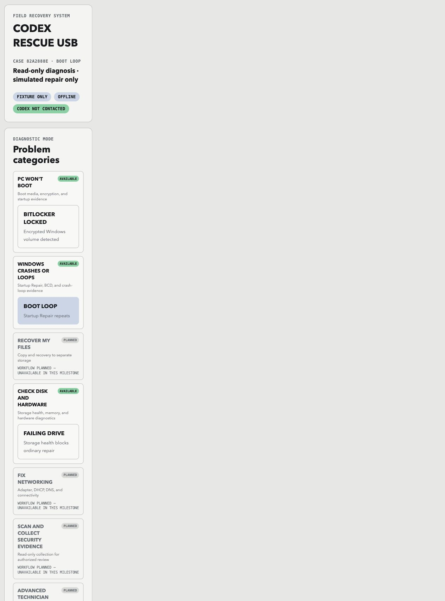

# Codex Rescue USB

> A safety-first, offline fixture console for PC-recovery workflows — without touching a real PC.

Codex Rescue USB is a host-runnable prototype for a future offline recovery environment. It diagnoses strictly validated demonstration fixtures, creates complete repair proposals, binds approval to the exact proposal and target, simulates one allowlisted repair, and verifies the result with separate post-action evidence.

It is not a bootable USB image and cannot repair a physical computer. The current milestone is a local Rescue Console for safely exploring recovery workflows.


## Features

- Runs locally on `127.0.0.1` with no network dependency.
- Diagnoses a boot loop, locked BitLocker volume, or failing drive fixture.
- Requires approval bound to the complete repair proposal and exact target.
- Simulates an allowlisted BCD reconstruction with zero host impact.
- Verifies separate post-action fixture evidence.
- Saves timestamped, hash-chained local audit records.

## Safety boundaries

- No bootable USB is created in this version.
- No real disk, volume, boot file, or host command is touched.
- BitLocker keys, passwords, tokens, and credentials are never requested.
- No Codex, model, or network service is contacted.

Do not use this prototype as a real recovery tool.

## Requirements

- Python 3.11 or newer
- A modern browser
- No third-party packages

## Install

```sh
git clone https://github.com/Morlock52/codex-rescue-usb.git
cd codex-rescue-usb
```

No package installation is needed; the console uses the Python standard library.

## Run

```sh
PYTHONPATH=src python3 -m codex_rescue --port 8080
```

Open [http://127.0.0.1:8080](http://127.0.0.1:8080). The service always binds to loopback, so it is not exposed to the local network.

Audit records are written to `~/.codex-rescue/cases` by default. Choose a different local directory when needed:

```sh
PYTHONPATH=src python3 -m codex_rescue --port 8080 --case-dir ./local-cases
```

Stop the server with `Ctrl+C`.

## Use the console

1. Start the server and open the local address.
2. Review the default **Boot loop** case or select **BitLocker locked** or **Failing drive**.
3. Inspect the evidence, likely cause, proposal, workflow facts, and safety boundary.
4. For the boot-loop fixture, review the simulated BCD reconstruction and rollback artifact.
5. Select **Approve exact simulated plan** after reviewing the proposal and target fingerprints.
6. Select **Run safe simulation**. This affects fixture state only.
7. Confirm independent verification, then open the hash-chained audit record if desired.

The BitLocker and failing-drive cases are expected safe stops: they intentionally do not offer an executable action.



## Demonstration fixtures

| Fixture | Purpose | Action available |
| --- | --- | --- |
| Boot loop | Diagnosis, approval, simulated BCD rebuild, and independent verification. | Simulation only |
| BitLocker locked | Blocked workflow without accepting recovery material. | No |
| Failing drive | Protected stop for storage-health risk. | No |

## Safety model

Each executable workflow validates fixture and rollback evidence, builds a complete proposal, binds one approval to its proposal and target digests, runs the allowlisted simulation once, and then checks independent post-action evidence. The safety broker rejects malformed, secret-bearing, mismatched, ambiguous, unapproved, or unsupported operations.

## Test

```sh
python3 -W error::ResourceWarning -m unittest discover -s tests -v
node --check web/assets/app.js
python3 -m compileall -q src tests
git diff --check
```

## Project layout

```text
src/codex_rescue/  Service, safety broker, fixture handling, and simulation
web/               Static browser console
fixtures/          Demonstration cases plus rollback and post-action evidence
tests/             Unit and HTTP integration tests
docs/images/       README screenshots captured from the local console
```

## Current scope

This release proves the safety and workflow model with deterministic fixtures. A real bootable recovery environment would be a separate milestone requiring hardware testing, threat modeling, and explicit approval for every real disk or encryption operation.

## References

- [Product and safety design](docs/plans/2026-08-04-codex-rescue-usb-design.md)
- [Fixture console implementation plan](docs/plans/2026-08-04-fixture-rescue-console-implementation.md)
- [Editable Figma Rescue Console](https://www.figma.com/design/sW9ctJbQnpgzx0DqJqwnbo)
